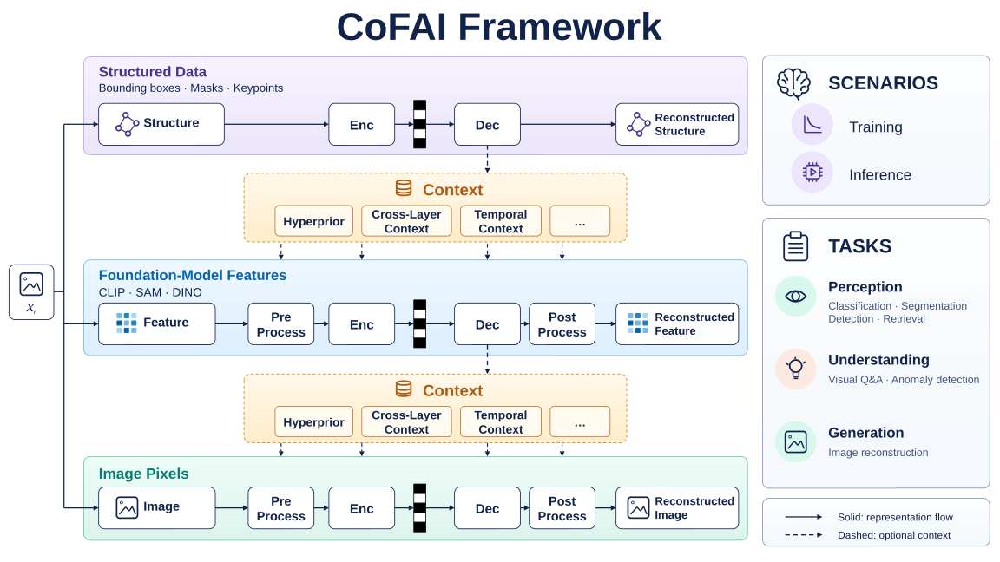
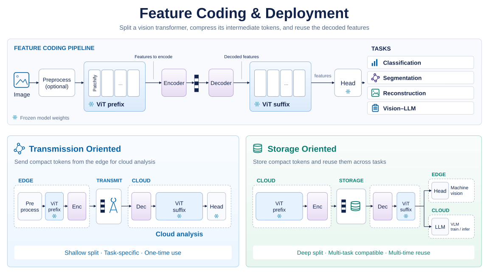

# CoFAI

## Introduction

CoFAI (Coding for AI) is a framework for compressing visual information used by AI systems. It brings together three types of representation: **structured data**, such as bounding boxes, masks, and keypoints; **foundation-model features**, the intermediate tensors extracted by visual models; and **image pixels**, the image or video content itself. The goal is to reduce storage and transmission costs while preserving the information needed for perception, understanding, and generation tasks.



These representations can be coded independently or together, using related information as **context** when appropriate—for example, information from another representation or an earlier frame. Each coding method defines which context is needed and how its coding cost is counted. The framework supports both exchanging data between devices and storing it for later reuse.

While CoFAI covers a broad range of representations and application scenarios, **feature coding is currently the main focus of our research**. Several feature-coding proposals have already been integrated into the reference software, providing implementations for studying and comparing different coding methods.

This repository serves as the reference software implementation for the feature coding group within the [AITISA standards organization](https://www.aitisa.org.cn/). Built on PyTorch, it provides reusable coding components, visual models, and a shared evaluation workflow for comparing task quality, coded size, and processing cost under consistent settings.

Start with [Getting Started](#getting-started) to run an evaluation, browse the [Coding Methods](#coding-methods) for a particular method, or read the [framework guide](docs/framework.md) for the full design.

## Feature Coding and Deployment

Feature coding compresses the intermediate tensors at a chosen point inside a visual model. This makes it possible to transmit or store features instead of the original image.



The **model prefix** is the part of a model that runs before the chosen split point; the **model suffix** is the part that runs after it. A **codec** encodes the intermediate features into a compact stream and decodes them back into features the remaining model can use. The task module then produces a class, segmentation mask, depth map, reconstructed image, or generated answer.

The lower half of the figure shows two ways to deploy this pipeline:

- **Transmission-oriented**: a device runs the model prefix and encoder, then sends the compressed features to a server that decodes them and completes the task.
- **Storage-oriented**: compressed features are saved for later use. After decoding, they can support machine-vision tasks or vision-language models.

The split point and feature reuse capability depend on the model and coding method. The diagram illustrates shallow and deep splits; snowflake symbols mark components whose weights are fixed during training.

## Reference Software

- **Reusable components** for visual models, feature codecs, index codecs, and task prediction.
- **A shared evaluation command**, `cofai-eval`, configured by a YAML **plan** that specifies the data, models, weights, tasks, and evaluation options.
- **Reference workflows** using DINOv2, DINOv3, and Qwen3-VL for classification, segmentation, depth estimation, image reconstruction, and visual question answering.
- **Joint reporting** of task quality, coded size, encoding and decoding time, and optional codec complexity.
- **A download command**, `cofai-download`, with file lists and checksum verification for data and weights.

The shared runtime focuses on single-image feature-coding evaluation; method-specific training workflows are documented under `examples/`. Token grouping and index coding are also implemented. Optional pre/post-processing interfaces remain part of the framework, with the generic post-processing implementation still to be developed. See the [implementation guide](docs/reference_software.md) for component interfaces and current coverage.

## Getting Started

### Requirements

The dependency versions declared in `pyproject.toml` are:

| Component | Version |
|---|---|
| Python | 3.10 or newer |
| PyTorch | 2.6.0 |
| torchvision | 0.21.0 |
| CUDA wheels | 12.4 |
| Transformers | 5.8 or newer, below 6.0 |

An NVIDIA GPU is recommended for the provided evaluation plans. Individual methods may also require external tools or model access, such as VTM binaries or Hugging Face checkpoints; their example documentation lists those requirements.

### Installation

[Poetry](https://python-poetry.org/docs/#installation) is the recommended environment manager.

```bash
git clone https://github.com/faymek/CoFAI.git
cd CoFAI

poetry install
poetry run python install.py
```

`install.py` creates a repository-local `.env` containing `PROJECT_ROOT`. Plans use this value to resolve datasets, weights, features, and output directories. If the repository is moved, update or recreate `.env` before running an evaluation.

### Run Your First Evaluation

A YAML plan describes one evaluation: which dataset to use, which model and weights to load, and which task to measure. The following example downloads the DINOv3 reference data and weights, then evaluates semantic segmentation on ADE20K. It uses **Bypass**, which passes features through without compression, as a reference for task quality.

The download manifest covers both segmentation and depth workflows, so it also downloads NYUv2 data and depth-head weights that are not needed for this example.

```bash
# Preview the required downloads without changing local files.
poetry run cofai-download examples/ctc/dinov3-ctc.manifest.txt --dry-run

# Download data and weights, with manifest checksum verification.
poetry run cofai-download examples/ctc/dinov3-ctc.manifest.txt

# Dataset archives currently need to be extracted manually.
unzip data/ADE20K.zip -d data/

# Run a complete plan on GPU 0.
CUDA_VISIBLE_DEVICES=0 poetry run cofai-eval \
  conf/plan/ade20k-val__dinov3-vitl16-slot24__Bypass__semseg.yaml
```

By default, a run writes the resolved `config.yaml` and `result.json` to `logs/<plan-name>/`. Multi-quality runs additionally write per-quality directories and a `summary.json`.

### Additional Evaluation Options

After running the baseline, you can measure codec complexity or compare compression settings using plan overrides:

```bash
# Measure codec parameter count, computation (FLOPs), and runtime.
CUDA_VISIBLE_DEVICES=0 poetry run cofai-eval \
  conf/plan/ade20k-val__dinov3-vitl16-slot24__Bypass__semseg.yaml \
  args.profile=true

# Evaluate the compression settings listed in a variable-rate plan.
CUDA_VISIBLE_DEVICES=0 poetry run cofai-eval \
  conf/plan/dinov2/ade20k-val__dinov2-vitb16-reg4-slot09__VTC-vbr__semseg-last4.yaml \
  args.multi_run=true
```

Variable-rate codecs provide several compression settings so that you can compare coded size against task quality. See the [evaluation guide](docs/engine.md) for plan fields, result files, and command-line options.

## Common Test Conditions

**CTC** means common test conditions: a shared choice of model, dataset, and evaluation settings used to compare coding methods. AI M2462 defines the following reference test conditions:

- [DINOv3 CTC](examples/ctc/README-DINOv3.md): ADE20K segmentation, NYUv2 depth, and codec profiling.
- [Qwen3-VL CTC](examples/ctc/README-QWEN3VL.md): visual question answering on MMStar with compressed intermediate vision features.

## Coding Methods

The table lists the coding methods and related techniques implemented in the reference software, together with their AITISA proposal numbers and implementation guides. Some methods use the shared evaluation command; others provide their own scripts. Each guide describes the required data, weights, preprocessing, and commands.

A dash indicates that no confirmed AITISA proposal number is listed.

| Method | AITISA proposal | Description | Implementation guide |
|---|---|---|---|
| MPC / MPC_I2 | AI M2269; AI M2352 | Multi-purpose coding and variable-rate DINOv2 feature coding | [MPC guide](examples/mpc/README.md) |
| RAE | AI M2417 | Image reconstruction from general-purpose visual representations | [MPC guide](examples/mpc/README.md) |
| LaMoFC and VTM | — | DINOv2 feature coding for classification and segmentation | [LaMoFC guide](examples/lamofc/README.md) |
| VQFC (FCVQ in earlier reports) | AI M2353 | Transform-free feature coding using entropy-constrained vector quantization | [VQFC guide](examples/vqfc/README.md) |
| VTC | AI M2418; AI M2448 | Dual-path visual-token coding with DINOv2; DINOv3 feature coding | [VTC guide](examples/vtc/README.md) |
| ORFC | AI M2411 | Product-quantization-based coding of intermediate ViT features | [ORFC guide](examples/orfc/README.md) |
| Soft-PQ / ORFC | AI M2446 | Learnable product-quantization feature coding with an orthogonal transform | [Soft-PQ guide](examples/orfc_2446/README.md) |
| GPS | AI M2405 | Graph-partition-based representation optimization for multi-view image search | [GPS guide](examples/gps/README.md) |
| Token Grouping | AI M2460 | Graph-partition-based token grouping for foundation-model feature coding | [GPS guide](examples/gps/README.md) |
| RFC | AI M2268 | Semantic feature disentanglement and compact representation with multi-task ViT models | [RFC guide](examples/rfc/README.md) |
| CAVC | AI M2328 | Video-feature joint coding for efficient adaptive video coding | [CAVC example](examples/cavc/) |
| ViTDet feature coding | AI M2306 | Vision Transformer feature-coding experiments for detection and segmentation | [ViTDet example](examples/vitdet/) |
| DCVC-RT | AI M2377 | Real-time neural video coding reference integration | [DCVC-RT example](examples/dcvc-rt/) |

Additional research examples include [SEI](examples/SEI/). These examples may use their own scripts and configuration formats.

## Data and Weights

Public benchmark assets are hosted at [CoFAI asset server](https://medialab.sjtu.edu.cn/files/CoFAI-share/). Several method guides provide a **manifest**: a text file listing the required data and weights, their download locations, and checksums. These files are stored under `examples/`.

```bash
# Download missing or invalid files.
poetry run cofai-download path/to/manifest.txt

# Verify local files without downloading.
poetry run cofai-download path/to/manifest.txt --verify

# Show the planned operations.
poetry run cofai-download path/to/manifest.txt --dry-run
```

Downloaded files are placed under `--root` when specified, otherwise under the exported `PROJECT_ROOT`, or the current directory when neither is set. The downloader creates parent directories but does not currently extract dataset archives. Depending on the selected plan, the resulting runtime directories may include:

```text
CoFAI/
|- data/       # evaluation datasets
|- weights/    # released checkpoints and external codec binaries
|- features/   # optional offline features
|- logs/       # evaluation results
`- runs/       # training logs and checkpoints
```

## Documentation and Development

- [Evaluation engine and plan contract](docs/engine.md)
- [CoFAI framework concepts](docs/framework.md)
- [Reference software implementation](docs/reference_software.md)
- [Hosted API documentation](https://faymek.github.io/CoFAI)
- [Migration guide from `mpcompress` to `cofai`](MIGRATION.md)
- [Development and contribution workflow](README_DEV.md)

New method implementations normally begin under `examples/`. Reusable components move into `cofai/` once their interfaces and evaluation behavior are stable.

## Acknowledgements

Special thanks to Donghui Feng, Bo Gao, Qingyue Ling, Fengxi Zhang, and Zekai Liu for their contributions to the testing platform.

Special thanks to Yifan Ma, Qiaoxi Chen, and Yenan Xu for their contributions to the LaMoFC integration.

CoFAI also builds on the PyTorch, CompressAI, Hydra, DINOv2, DINOv3, Transformers, and VTM ecosystems, as well as the research implementations referenced by each example.
