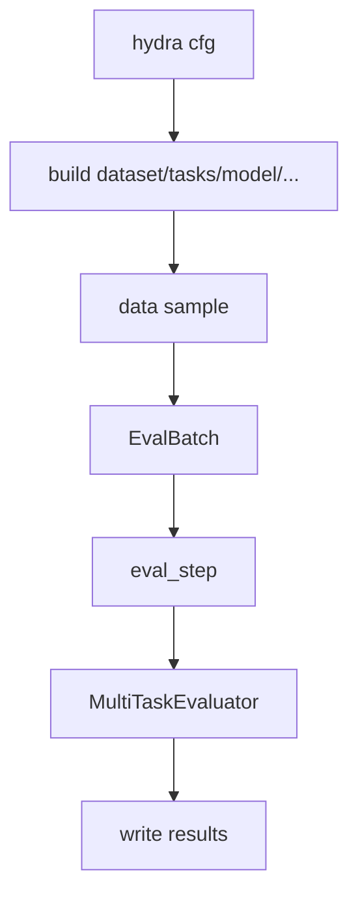

# Engine 架构与数据流

**设计理念**：我们希望用一份 **`plan`** 把一次运行的关键细节都「定死」——数据集、预处理、任务与指标、模型结构、权重加载、推理参数、输出位置等。不同方法只要换 **`plan`**（或在命令行显式覆盖少数参数），就能在**同一套评测口径**下做可复现、可审计、相对公平的对比。

**工作流约定（提案集成与公共能力沉淀）**：新的方法/提案通常先以“可运行参考实现”的形式集成到 `examples/`，优先完成评测接口的基本对齐与可复现跑通；在后续每次参考软件更新的窗口期，我们会把多提案复用的需求与实现逐步吸收到公共代码（`cofai/` ）中，减少重复实现与口径漂移。

目前这套 `engine` **主要用于评测**；训练/验证相关还需要完善。

## 1. 快速开始

### 1.1 准备数据

请从公共网盘下载对应的数据集和模型权重，同步放置到 data/ 和 weights/ 目录下。当前网盘地址为 https://medialab.sjtu.edu.cn/files/CoFAI-share/

运行 python install.py，这将设置 PROJECT_HOME 环境变量为代码的根目录，并且保存到 .env 文件中，这个环境变量在整个代码仓库用到。

### 1.2 运行评测

入口：**`poetry run cofai-eval`**（与 **`python -m cofai.engine.run_eval`** 相同）。

Plan 一般放在 **`conf/plan/*.yaml`**。

```bash
poetry run cofai-eval \
  conf/plan/pascal-context--RFC-edge.yaml \
  args.real=true \
  args.max_samples=10
```

等价写法（`--config-name`）：

```bash
poetry run cofai-eval \
  --config-name=plan/ade20k-val--MPC2-v3-small-vbr \
  args.cuda=true \
  args.real=true
```

### 1.3 常用覆盖项

- `args.cuda=true/false`
- `args.real=true/false` （是否进行真实编码）
- `args.multi_run=true/false`（是否按 plan 的 `multi_run` 多 quality 跑并写 `summary.json`）
- `args.quality=...`（单跑时使用；传给 `inference_model` 的 `qp`）
- `args.output_dir=...`（自定义输出目录，结果将保存到 `<output_dir>/<plan.name>/result.json`，默认输出目录是 `logs/`）
- `args.max_samples=...`（仅测试少量样本，做临时测试）

### 1.4 多档 quality（`multi_run`，可选）

当 plan 里配置了 **`multi_run`**，并在命令行打开 **`args.multi_run=true`** 时，则会运行多轮的评估，将得到的结果视为多个RD点收集起来。该配置的键为 **qp/quality 整数**，值为可选的 patch 配置，在跑每个run时，会把qp输入到 codec，再把patch该配置合并到主配置中，得到新的配置，然后进行评估。

示例（ImageNet sel2k、MPC base VBR、真实编解码、扫描 plan 里列出的多个 qp）：

```bash
CUDA_VISIBLE_DEVICES=4 poetry run cofai-eval \
  conf/plan/imagenet-sel2k--MPC2-v3-base-vbr.yaml \
  args.real=true \
  args.multi_run=true
```


## 2. Plan 文件概览

plan 文件的格式为 YAML，其内容包括：

- name: 计划名称
- description: 计划描述
- dataset: 数据集配置
- test_transforms: 测试变换配置
- task_configs: 任务配置
- model: 模型配置
- load: 模型权重加载配置

plan 文件可以用 Hydra 语法进行覆盖，也可以拼装多份配置。当需要复用已有的组件时，可以在 plan 顶部 **`defaults:`** 拉 **`/args`**、**`/dataloader`**、**`/data`**、**`/model`**、**`/heads`**、**`/metrics`** 等，再在 plan 的对应位置进行引用。

**最短骨架示例**：

```yaml
# @package _global_
defaults:
  - /args: default
  - /dataloader: default
  - /data: imagenet_sel2k
  - /model: your-model-group-name
  - /heads: dinov2_head
  - /metrics:
    - cls_metrics
  - _self_

name: my-plan
description: "one-line purpose"
dataset: ${datasets.imagenet_sel2k}
test_transforms:
  - type: cofai.transforms.PadToMultiple
    multiple: 64
task_configs:
  - label: cls
    meter: ${metrics.cls_metrics}
model:
  type: YourModel
  # ...
```

---

## 3. 端到端数据流（eval）

从配置解析、组件构建、循环评测、最后落盘的主链路如下：




dataset + transforms 统一产出 **`img`**、任务 payload 与图像 **`meta`**。例如 VQA 信息全部位于 **`vqa`** 下，语义分割和深度分别位于 **`semseg`**、**`depth`** 下。随后经 **`collate_fn`** → **`EvalBatch`** → 统一 eval loop。

在 eval loop 中，每个 batch 输入 **`eval_step(...)`** 得到 **`StepOutput`**，evaluator 聚合指标并收集逐样本 **`records`**。最后汇总各任务指标落盘结果。

需要注意：当前 **`eval_step`** 路径**只支持 `batch_size=1`**。


### 3.1 启动与计划解析

入口 **`cofai-eval`**（**`python -m cofai.engine.run_eval`**），采用了 hydra 提供的配置解析功能，将 plan 文件解析为配置对象cfg。对于输入的 cfg，代码内做了校验以满足 plan 的约束。

### 3.2 组件构建

采用 cofai.engine.registry 构建组件。在配置文件中可以通过 type: package_name.class_name 来实例化一个模型。带有 package name的全名是推荐做法，当前仅有 class_name 的短名也是支持的，但是当前阶段没有去判断是否重合，可能会导致歧义。 

拿到配置文件后，会按配置构建四类组件：

1. **dataset**：**`cfg.dataset`**，从数据集读取 dict sample。
2. **transforms**：**`cfg.test_transforms`**，将多个sample 按 dict key 做对应的变换。
3. **collate_fn**：将多个sample 按 dict key 做对应的变换。
4. **evaluator & meters**：**`cfg.task_configs[*]`**（**`label`** / **`kind`** / **`meter`**），并初始化对应的 meter，一个 meter 对应一类任务，对应多个指标。
5. **model**：**`cfg.model`**（可选 **`cfg.load`**）。

### 3.3 数据处理

dataset + transforms 产出 **样本 dict**（每条必须含 **`img`** 与 **`meta`**，并按任务 kind 携带可选 payload）→ **`collate_fn`** → **`EvalBatch`** → 统一 eval loop：

EvalBatch 数据结构

- **`inputs["img"]`**：批次内各样本的 **`img`**（CHW）**`stack`**（必要时 pad）→ **`[B,C,H,W]`**。
- **`samples`**：**`len(samples)==B`**。第 i 条为去掉 **`img`** 后的样本，任务额外输入和标注均保留在对应 kind 下，例如 **`samples[i]["vqa"]`**。

### 3.4 模型评估

第一步将 **`batch.inputs["img"]`** 送入模型，并按 plan 声明的 kind 从 **`batch.samples[0]`** 收集 **`task_data`**。`task_data` 只传给 `forward_test` / `decompress`，不传给 `compress`。具体模型只读取自己需要的任务额外输入；例如 Qwen3VL wrapper 只将 **`task_data["vqa"]["prompt"]`** 下传给 Qwen。

第二步评估任务性能，**GT** 从 **`batch.samples[0]`** 按 **`kind`** 取**顶层键**（与数据集字段名一致）。**`pred[label]`** 由 **`task_decode_pred(task_feats[label], kind)`**得到。组装 **`pred`/`gt`** 后：若 **`samples[0]["meta"]`** 中存在 **`valid_roi`**，则仅对 **`kind=rec`** 的任务在送入 meter 前将 **`pred[label]`** 与 **`gt[label]`**（CHW）裁剪到该 ROI（动机与变换约定见 **§8**）。

### 3.5 汇总与落盘

汇总各任务指标与 **`records`** 后：

- **`result.json`**：运行结果与逐样本记录。
- **`config.yaml`**：本次 compose 后的最终配置（复现用）。

**`multi_run`** 时另有 **`summary.json`** 与各 **`q<qp>/`** 子目录，每个子目录下包含该质量点的运行结果，summary.json 则汇总了所有指标的运行结果。


## 5. 关键数据契约

### 5.1 数据处理（dataset → transforms → collate）

随着评测与训练覆盖的**任务类型变多**（分类、分割、重建、深度等并存），单条样本往往需要同时携带影像、多种标注与元数据，**数据结构的内在复杂性**会随之上升：若每种组合都单独定义类型或专用管线，扩展与维护成本都会很高。

这里的约定在**设计思路上参考 [MMEngine](https://github.com/open-mmlab/mmengine)** 一脉的做法——用 **`dict` 表达样本、用键驱动变换与组装**，便于多任务扩展与组合；同时**实现上刻意保持简单**：评测路径只保留 **`EvalBatch`** 与薄层 **`collate_fn`**，不引入完整 Runner / Hook 体系，以降低心智负担并方便后续演进。


1. **Dataset 返回 `dict`**：每条样本必须包含共享图像 **`img`**、仅描述图像的 **`meta`**，以及与 evaluator **`kind`** 对齐的可选任务 payload。VQA 的 prompt、question、answer、options、category 等全部位于 **`vqa`** 下。
2. **Transforms 按 key 操作**：复合变换（如 **`PadToMultiple`**、**`ToTensor`**）通过配置里的 **`keys: [img, semseg, ...]`** 声明作用在哪些字段上，使几何与 dtype 变换在多任务键之间保持一致；输出仍是 **`dict`**，供 collate 消费。
3. **`collate_fn` 打成 `EvalBatch`**：无条件将每条 **`img`** 转为 CHW 并堆叠为 **`inputs["img"]`**（**`[B,C,H,W]`**）；其余任务 payload 和 **`meta`** 按样本保留在 **`samples`**。

### 5.2 EvalBatch（`inputs` + `samples`）

在 EvalBatch 数据结构中，**批量张量放进 `inputs`字典，逐样本上下文与 GT 放进 `samples`列表**。

| 字段 | 含义 |
| --- | --- |
| **`inputs`** | `Dict[str, Any]`。所有图像任务均包含 **`img: Tensor[B,C,H,W]`**。 |
| **`samples`** | **`List[dict]`**，**`len(samples) == B`**。每条包含任务 payload 与图像 `meta`，不再包含 `img`。 |

**每条 `samples[i]` 的推荐形状**

- **`meta`**：`dict`，放置 **`ori_size`**，**`img_path` / `img_name`** 等，还有一些随变换写入的辅助信息。
- **任务 payload 键**（**与 `meta` 平级**）：如 **`semseg`**、**`cls`**、**`rec`**、**`depth`**、**`vqa`** 等。无需额外输入的任务可直接以标注为值；VQA 等任务使用 dict 同时携带任务额外输入和评测标注。

### 5.3 StepOutput

EvalBatch 经过评估评估得到的中间结果：

- `timing: Dict[str, float]`：例如 `enc_time/dec_time`。
- `bits: Dict[str, float]`：码率统计项。
- `pred/gt: Dict[label, Any]`：按任务 label 对齐。
- `per_sample_records: List[dict]`：逐样本记录，常见字段 `file/quality/enc_time/dec_time/bpp`。

### 5.4 TaskConfig 关键语义

一般而言，一种输出特征对应一个任务，但也存在例外。为兼容各类情况，我们采用以下两个概念加以区分：任务类型（以 `kind` / `gt_key` 表示）是有限的，而 `label` 可任意命名，但通常与 `kind` 同名。`task_configs` 提供 `kind` 与 `label` 之间的映射关系。

- **任务命名约定**：
  - **`kind` 即 `gt_key`**：数据集返回的 GT 字段名，是跨数据集统一的"模态/任务"命名（例如 `rec`、`semseg`、`edge`、`depth` 等）。
  - **`label` 即 `out_key`**：模型输出 `task_feats` 的键名。同一模态可以有多个方案或变体，通过不同的 `label` 区分（例如 `rec1`、`rec2`，其 `kind` 均为 `rec`，对应重建任务）。
  - **契约**：eval loop 从 `EvalBatch.samples[i]` 读取 kind 对应的 GT 结果，从 task_feats 中获取 label 对应的预测结果，将二者输入 meter 得到指标结果。
  - **`kind` 的允许集合（严格模式）**：定义于 `cofai/engine/evaluator.py` 中的 `ALLOWED_KINDS`，当前包含 `rec`、`semseg`、`cls`、`depth`、`edge`、`sal`、`normals`、`scene`、`human_parts`、`vqa`。若不在集合内，将触发 fail-fast 报错。

- **既往实现的迁移说明**：
  - **重建语义（rec）**：以 `kind=rec` 标识重建模态，`label` 可自由命名（例如 `rae`）。
  - **仅保留 `semseg`**：语义分割统一采用 `semseg` 命名，不再使用 `seg` 。

#### 5.4.1 示例：PASCAL-Context（多 GT 字段）

PASCAL-Context 数据集在样本 dict 中同时提供多个 GT 字段（如 `semseg`、`edge`、`human_parts`、`normals`、`sal`）。根据上述约定：

- `kind` 使用对应的字段名（即 `gt_key`）；
- `label` 可与 `kind` 同名（最简单的情形），也可附加方法或版本后缀（用于对比不同输出方案）。

#### 5.4.2 示例：重建评测（单一 GT 字段，多输出方案）

以重建任务为例，数据集统一提供 `rec` GT：

- 数据集样本：`{"img": ..., "rec": <gt_image>, "meta": ...}`
- plan：`task_configs: [{label: rae_512, kind: rec, meter: ...}]`
- 模型输出：`task_feats["rae_512"] = <pred_image>`

最终 meter 看到的是：`pred["rae_512"]` 与 `gt["rae_512"]` 对齐，其中 **gt** 来自 **`EvalBatch.samples[0]["rec"]`**（即打包前进数据集样本 dict 的 **`rec`** 字段）。

#### 5.4.3 pad 与重建指标：`valid_roi` 与 `SetImageAsOriginal`

推理侧常把 **`img`/`rec`** 做 **中心对称 pad**（例如 **`cofai.transforms.PadToMultiple`**）以满足 patch / 编解码对齐；若直接在 pad 后的整幅图上算 PSNR、MS-SSIM，会把 pad 区域（如填零带）算进分母，口径偏离「原有效内容」。

约定如下：

1. **`PadToMultiple`**（[`cofai/transforms/core.py`](cofai/transforms/core.py)）：对各 **`keys`** 完成 pad 后，在 **`meta`** 中写入 **`valid_roi`**，形如 **`{top, left, height, width}`**（整数，相对 **pad 后** 画布的行/列索引）。语义为：有效内容与 pad 前一致的那块矩形，位置与中心 pad 规则一致；若本无需 pad，则为 **`top=left=0`，`height`/`width` 等于 pad 前空间尺寸**。
2. **`SetImageAsOriginal`**（同文件）：无参变换；当样本含 **`img`** 与 **`meta`** 时，将 **`meta["ori_size"]`** 设为 **当前 `img` 的 `(H,W)`**。典型用法是插在 **Resize 等改变分辨率之后、Pad 之前**：把 **「当前分辨率」** 作为 bpp 与后续锚定的 **`ori_size`**，与数据集初次写入的原始文件尺寸脱钩。
3. **`eval_step`**（[`cofai/engine/run_eval.py`](cofai/engine/run_eval.py)）：若 **`meta.get("valid_roi")`** 存在，则仅对 **`kind=rec`** 的 **`pred`/`gt`** 按 **`valid_roi`** 做 CHW 切片后再交给各任务的 meter；若无该键，则行为与未引入 ROI 时一致（整幅 pad 后张量参与指标）。

其它几何变换（Resize、RandomCrop、CenterCrop 等）当前 **不负责** 维护 **`valid_roi`**；若管线中 pad 前还有复杂几何，需自行保证 **`valid_roi` 与真实有效区一致**，或扩展对应变换的写入逻辑。


### 5.5 码率统计

**契约**：自定义 codec 或 **`compress`/`decompress`** 返回结构时，须返回兼容性的 coded_unit 或者 coded_data 字典。之后由 _bits_from_coded_data 解析得到 **`bits`**。

对于每个sample，可以访问其 meta 获取 ori_size，之后根据 ori_size 计算 bpp。对于每个特征，模型可以实现 get_feature_numel 方法，返回该特征的元素数量，以计算 bpfp。


## 6. 开发者指南

1. **新配置**：
    - 新增/维护计划优先落在 `conf/plan/*.yaml`；命令行可写 **`conf/plan/<file>.yaml`**，或 **`--config-name=plan/<file>`**（无 `.yaml` 后缀）。
    - 可以使用 Hydra 语法来重载某个配置文件，或者组装多个配置文件形成最终的 plan 配置。
2. **新模型**：
    - 在 cofai/model/*.py 中添加模型，实现 `forward_test(...)` 和 `compress(...)` / `decompress(...)`；
    - 确保接口返回 coded_data 和 task_feats 字典。
3. **新 head 实现**：
    - 在 cofai/head/*.py 中添加 head，实现 forward 或者 predict 方法；
    - 在 Model 中实现 heads 的实例化，按需加载 heads
    - 在 task_decode_pred 函数中实现最终的 argmax 等操作（这部分需要改善）
3. **新任务**：
    - 在 `plan.task_configs` 增加条目，并明确 `label/kind/meter`；
    - 在 `plan.task_configs[*]` 中声明任务，并在 `task_configs[*].meter` 指向新 meter 类（同样通过 `type:` 装配）。
4. **积极协商**：
    - 当前 eval 协议尽量做到通用，但仍然可能没法满足所有场景
    - 提案方可以与维护者积极协商共同解决问题，确保评测协议的通用性。
