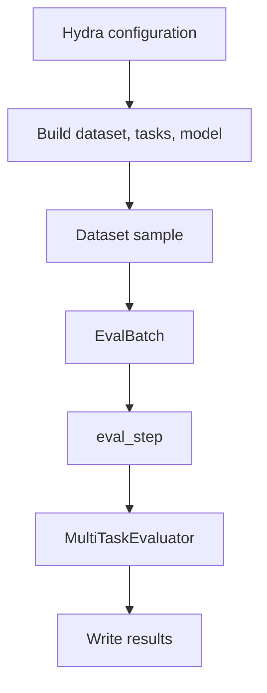

# Evaluation Engine Architecture and Data Flow

This guide covers plans, data contracts, the evaluation loop, and result files. See the [framework guide](framework.md) for representation and coded-data concepts, and the [implementation guide](reference_software.md) for models, codecs, slots, and multi-stream DUs.

A **plan** fixes the key conditions of a run: dataset, preprocessing, tasks, metrics, model structure, weights, inference options, and outputs. Switching plans or applying explicit overrides allows methods to be compared under a shared, reproducible evaluation protocol.

New methods normally begin as runnable reference implementations in `examples/`. Reusable components move into `cofai/` once concrete cross-method reuse needs are established. This avoids duplicated implementations and inconsistent evaluation conditions.

The current shared engine primarily supports evaluation. Training and validation support still require further development.

## 1. Quick Start

### 1.1 Prepare Data

Methods declare data and weights in `examples/<method>/*.manifest.txt`. Preview a manifest with `poetry run cofai-download <manifest> --dry-run`, then download its assets into `data/` and `weights/`. Public assets are hosted on the [CoFAI asset server](https://medialab.sjtu.edu.cn/files/CoFAI-share/).

Run `poetry run python install.py` to create a repository-root `.env` containing `PROJECT_ROOT`. Plans use this variable to resolve data, weights, and output paths.

### 1.2 Run an Evaluation

The entry point is `poetry run cofai-eval`, equivalent to `poetry run python -m cofai.engine.run_eval`. Plans are generally stored under `conf/plan/`.

```bash
poetry run cofai-eval \
  conf/plan/ade20k-val__dinov3-vitl16-slot24__Bypass__semseg.yaml \
  args.profile=true
```

The equivalent command using `--config-name` is:

```bash
poetry run cofai-eval \
  --config-name=plan/ade20k-val__dinov3-vitl16-slot24__Bypass__semseg \
  args.profile=true
```

### 1.3 Common Overrides

- `args.cuda=true/false`: enable or disable CUDA.
- `args.real=true/false`: use actual coding or the forward evaluation path.
- `args.multi_run=true/false`: evaluate the plan's quality settings and write `summary.json`.
- `args.quality=...`: select a single-run quality setting, passed to `inference_model` as `qp`.
- `args.output_dir=...`: write results to `<output_dir>/<plan.name>/result.json`; the default output directory is `logs/`.
- `args.max_samples=...`: limit samples for temporary diagnostic tests, not a substitute for a complete evaluation.

### 1.4 Multiple Quality Settings

If a plan defines `multi_run` and `args.multi_run=true` is enabled, each configured setting is evaluated as a separate rate–distortion point. Keys are integer QP/quality values; values are optional configuration patches. Each run passes its QP to the codec and merges the corresponding patch into the configuration.

For example, evaluate the quality settings in the ADE20K DINOv2 VTC VBR plan using actual encoding and decoding:

```bash
CUDA_VISIBLE_DEVICES=0 poetry run cofai-eval \
  conf/plan/dinov2/ade20k-val__dinov2-vitb16-reg4-slot09__VTC-vbr__semseg-last4.yaml \
  args.multi_run=true
```

## 2. Plan Structure

Plans are YAML files containing:

- `name`: plan name.
- `description`: purpose of the plan.
- `dataset`: dataset configuration.
- `test_transforms`: evaluation transforms.
- `task_configs`: tasks and metrics.
- `model`: model orchestration and components.
- `load`: weight-loading configuration.

Hydra supports overrides and composition of multiple configurations. A plan's `defaults` may import `/args`, `/dataloader`, `/data`, `/heads`, and `/metrics`, then reference those components. Model definitions are generally contained in the plan itself.

A minimal skeleton is:

```yaml
# @package _global_
defaults:
  - /args: default
  - /dataloader: default
  - /data: imagenet_sel2k
  - /heads: dinov2_head
  - /metrics:
    - cls_metrics
  - _self_

name: my-plan
description: "one-line purpose"
dataset: ${datasets.imagenet_sel2k}
test_transforms:
  - type: cofai.transforms.PadToMultiple
    multiple: 64
task_configs:
  - label: cls
    meter: ${metrics.cls_metrics}
model:
  type: YourModel
  # ...
```

## 3. End-to-End Evaluation Flow

The main path runs from configuration composition through component building and evaluation to result writing:


```mermaid
flowchart TB
  CLI["Hydra configuration"]
  BLD["Build dataset, tasks, model"]
  DS["Dataset sample"]
  EB["EvalBatch"]
  STEP["eval_step"]
  EVA["MultiTaskEvaluator"]
  OUT["Write results"]
  CLI --> BLD --> DS --> EB --> STEP --> EVA --> OUT
```

Datasets and transforms produce `img`, task payloads, and image `meta`. VQA data lives under `vqa`; segmentation and depth data live under `semseg` and `depth`. `collate_fn` packs samples into `EvalBatch` for the shared loop.

For each batch, `eval_step(...)` returns `StepOutput`. The evaluator aggregates task metrics and collects per-sample `records`, then writes the results.

The current `eval_step` path supports **`batch_size=1` only**.

### 3.1 Entry Point and Plan Parsing

`cofai-eval` uses Hydra to compose the plan into `cfg`. The implementation validates the resulting configuration against the plan contract.

### 3.2 Component Building

`cofai.engine.registry` builds components from configuration. Prefer a fully qualified `type: package_name.class_name`. Short class names are also supported, but may be ambiguous when names collide.

The configuration builds:

1. **Dataset** from `cfg.dataset`, returning dictionary samples.
2. **Transforms** from `cfg.test_transforms`, operating on configured sample keys.
3. **Collation**, packing image tensors and preserving per-sample payloads.
4. **Evaluator and task meters** from `cfg.task_configs[*]`, with `label`, `kind`, and `meter`. Each meter handles a task and its metrics.
5. **Model** from `cfg.model`, with optional weight loading from `cfg.load`.

### 3.3 Data Preparation

Each sample contains `img`, image `meta`, and optional task payloads under their task kinds. After collation:

- `inputs["img"]` contains stacked CHW image tensors with shape `[B,C,H,W]`. Transforms must ensure compatible spatial sizes before stacking.
- `samples` has length `B`. Each entry preserves the sample except for `img`, including metadata, annotations, and extra task inputs such as `samples[i]["vqa"]`.

### 3.4 Model Evaluation

The engine passes `batch.inputs["img"]` to the model and gathers `task_data` from `batch.samples[0]` using the configured task kinds. `task_data` is passed to `forward_test` and `decompress`, not `compress`. Models consume only the extra inputs they need; for example, the Qwen3-VL wrapper forwards `task_data["vqa"]["prompt"]` to Qwen.

Ground truth is read from top-level sample keys selected by `kind`. Predictions are obtained as `pred[label] = task_decode_pred(task_feats[label], kind)`. If `samples[0]["meta"]` contains `valid_roi`, reconstruction tasks (`kind=rec`) crop both predictions and ground truth to that ROI before metric computation. See [padding and reconstruction metrics](#443-padding-and-reconstruction-metrics) for the transform contract.

### 3.5 Aggregation and Outputs

- `result.json` stores run results and per-sample records.
- `config.yaml` stores the complete resolved configuration for reproduction.

Multi-quality evaluation also writes `summary.json` and one `q<qp>/` directory per quality setting. Each directory contains that run's results; the summary aggregates the metrics across runs.

## 4. Data Contracts

### 4.1 Dataset, Transforms, and Collation

Multi-task samples may contain images, several annotation types, and metadata. Using dictionaries and key-driven transforms supports these combinations without a separate pipeline for every task set.

This design follows the dictionary-based sample and packing approach used in [MMEngine](https://github.com/open-mmlab/mmengine). The evaluation path uses `EvalBatch` and a lightweight `collate_fn` to pack shared inputs and per-sample data.

1. **Datasets return dictionaries** containing `img`, image `meta`, and optional payloads matching evaluator task kinds. VQA prompts, questions, answers, options, and categories all belong under `vqa`.
2. **Transforms operate on keys**. Transforms such as `PadToMultiple` and `ToTensor` use `keys: [img, semseg, ...]` to coordinate geometry and dtype handling across fields. Their output remains a dictionary.
3. **Collation produces `EvalBatch`**. Images are converted to CHW and stacked into `inputs["img"]` with shape `[B,C,H,W]`; metadata and other payloads remain in `samples`.

### 4.2 EvalBatch

Batch tensors belong in `inputs`; per-sample context and ground truth belong in `samples`.

| Field | Contract |
|---|---|
| `inputs` | `Dict[str, Any]`, including `img: Tensor[B,C,H,W]` for image tasks |
| `samples` | `List[dict]` with `len(samples) == B`; each entry contains task payloads and image `meta`, but no `img` |

Recommended per-sample fields are:

- `meta`: a dictionary containing `ori_size`, `img_path` or `img_name`, and auxiliary information written by transforms.
- Task payloads such as `semseg`, `cls`, `rec`, `depth`, or `vqa`, at the same level as `meta`. Tasks without extra inputs may store annotations directly; VQA uses a dictionary containing both task inputs and evaluation annotations.

### 4.3 StepOutput

`StepOutput` holds the intermediate evaluation results:

- `timing: Dict[str, float]`, for example `enc_time` and `dec_time`.
- `bits: Dict[str, float]` for bitrate accounting.
- `pred` and `gt`, keyed by task label.
- `per_sample_records: List[dict]`, commonly including `file`, `quality`, `enc_time`, `dec_time`, and `bpp`.

### 4.4 TaskConfig Semantics

Task kinds identify a limited set of ground-truth semantics. Output labels may be freely named and often match the kind. `task_configs` maps between them so multiple output variants can serve the same task.

- **`kind` / `gt_key`** identifies the dataset's ground-truth field, such as `rec`, `semseg`, `edge`, or `depth`.
- **`label` / `out_key`** identifies the model's `task_feats` output. For example, `rec1` and `rec2` may both use `kind=rec`.
- The evaluation loop reads ground truth by kind and predictions by label, then supplies the aligned pair to the task meter.
- Valid kinds are defined by `ALLOWED_KINDS` in `cofai.engine.evaluator`: `rec`, `semseg`, `cls`, `depth`, `edge`, `sal`, `normals`, `scene`, `human_parts`, and `vqa`. Invalid explicit kinds fail validation.

For migration from older implementations, use `kind=rec` for reconstruction even when its output label is named differently, such as `rae`. Use `semseg` for semantic segmentation rather than `seg`.

#### 4.4.1 Multiple Ground-Truth Fields

A PASCAL-Context sample may contain `semseg`, `edge`, `human_parts`, `normals`, and `sal`. Each task's kind selects its ground-truth field. Its label can match the kind or include a method/version suffix when comparing multiple output variants.

#### 4.4.2 Multiple Reconstruction Outputs

A reconstruction dataset provides one `rec` ground-truth field:

- Sample: `{"img": ..., "rec": <gt_image>, "meta": ...}`.
- Plan: `task_configs: [{label: rae_512, kind: rec, meter: ...}]`.
- Model output: `task_feats["rae_512"] = <pred_image>`.

The meter compares `pred["rae_512"]` with `gt["rae_512"]`; the latter comes from `EvalBatch.samples[0]["rec"]`.

#### 4.4.3 Padding and Reconstruction Metrics

Inference may symmetrically pad `img` and `rec` to satisfy patch or codec alignment. Computing PSNR or MS-SSIM on the entire padded image would include padding rather than only valid content.

1. [`PadToMultiple`](api/transforms.md#cofai.transforms.PadToMultiple) writes `meta["valid_roi"]` after padding its configured keys. The ROI contains integer `top`, `left`, `height`, and `width` relative to the padded canvas, identifying the original valid rectangle. When padding is unnecessary, `top=left=0` and the dimensions equal the unpadded image size.
2. `SetImageAsOriginal`, in the same module, sets `meta["ori_size"]` to the current image's `(H,W)`. Place it after resolution-changing transforms such as resize and before padding when the resized resolution should define the BPP denominator.
3. [`eval_step`](api/engine.md#cofai.engine.run_eval.eval_step) crops CHW predictions and ground truth to `valid_roi` only for reconstruction tasks before passing them to meters. Without the ROI field, the full tensor is evaluated.

Other geometry transforms, including resize and random or center crops, do not currently maintain `valid_roi`. The transform pipeline must ensure that the ROI matches the actual valid region, or extend the relevant transforms to update it.

### 4.5 Bitrate Accounting

Custom codecs and model `compress`/`decompress` interfaces must use compatible coded-unit or coded-data structures. `cofai.engine.bitrate.bits_from_coded_data` extracts bit counts from them.

The engine computes BPP from each sample's `meta["ori_size"]`. A model may implement `get_feature_numel` to provide the feature-element count used for BPFP.

## 5. Developer Guide

1. **Plans**: add or maintain configurations under `conf/plan/`. Commands accept a YAML path or `--config-name=plan/<file>` without the `.yaml` suffix. Use Hydra overrides and composition to assemble the final configuration.
2. **Models**: add models under `cofai/models/` and implement `forward_test`, `compress`, and `decompress` as required by the evaluation paths. Return compatible coded-data and task-feature mappings.
3. **Task heads**: add heads under `cofai/heads/` with `forward` or `predict`. Model classes instantiate and load them as needed. `task_decode_pred` handles final task-specific conversion such as `argmax`; this boundary still needs refinement.
4. **Tasks**: declare `label`, `kind`, and `meter` in `task_configs`. Configure new meter classes through `type`.
5. **Protocol changes**: discuss unsupported scenarios with method maintainers so extensions preserve shared evaluation semantics rather than creating incompatible paths.
