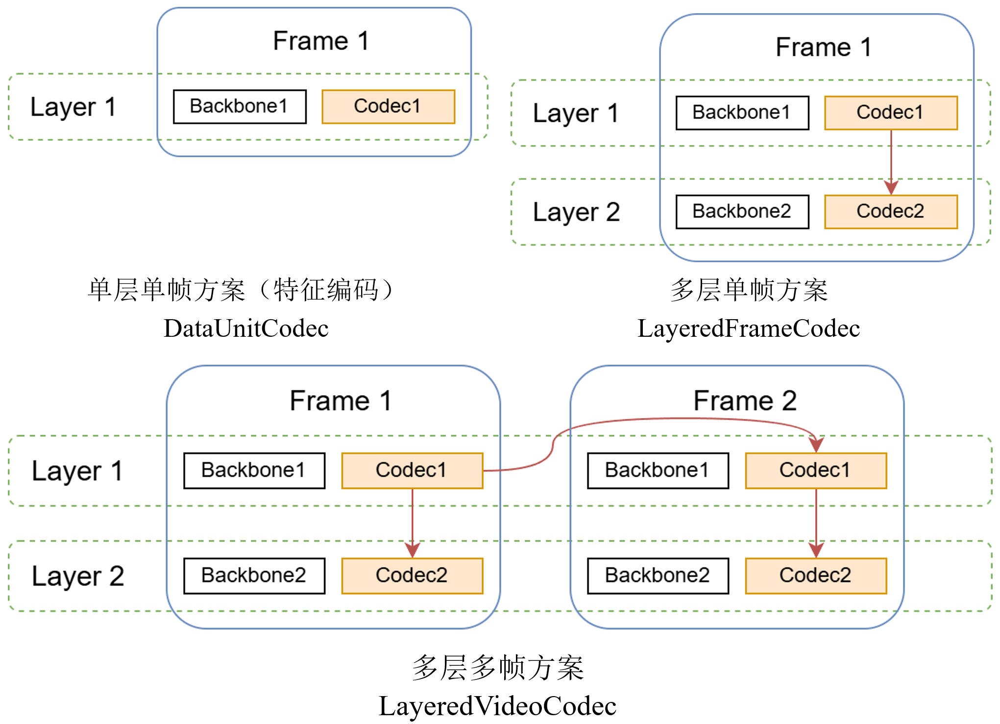

# CoFAI Framework

CoFAI (Coding for AI) studies how to organize, code, transmit, and reuse visual representations for AI perception, understanding, and generation. Its framework covers representation types, context dependencies, coded-data organization, and task evaluation.

This guide describes the conceptual framework and the encoder semantic conventions used to organize its representations, coded streams, and decoding state. See the [reference software implementation](reference_software.md) for current coverage and component mappings, and the [evaluation engine guide](engine.md) for plans, execution, and evaluation data contracts.

## 1. Goals and Scope

Traditional image and video coding primarily targets human viewing. Coding for AI also needs to address:

- Whether intermediate representations can be reused across tasks or models.
- How devices exchange compact representations at model split points.
- How pixels, foundation-model features, and structured semantics can be coded jointly.
- How cross-layer and temporal context can improve coding efficiency.
- How methods can be compared using consistent data, preprocessing, bitrate definitions, and task metrics.

CoFAI covers two typical deployment patterns:

1. **Storage and feature reuse**: features are saved offline for repeated use by downstream tasks or models.
2. **Edge–cloud collaboration**: a model is split into a device-side prefix and a server-side suffix; coded intermediate representations are exchanged for inference or subsequent training.

The framework supports three task families:

- **Perception**: classification, segmentation, detection, and retrieval.
- **Understanding**: visual question answering and anomaly detection.
- **Generation**: image reconstruction and other generation tasks.

## 2. Three Representation Types

CoFAI groups codable visual information into three representation types. They can be coded independently or together; their coding-unit organization is described in [Coded-Data Organization](#5-coded-data-organization).

| Representation | Meaning | Examples |
|---|---|---|
| Structured data | Extracted discrete or structured semantics | Text, bounding boxes, segmentation masks, keypoints, motion |
| Foundation-model features | Continuous or discrete intermediate representations at a model split point | DINO, SigLIP, vision-language model features, ReID tokens |
| Image pixels | Pixel representations for viewing, reconstruction, or generation | Original images, reconstructed images, video frames |


The branches can be used independently or together. Each method selects its context and specifies how both encoder and decoder obtain it.

Structural information can be carried as a representation in its own DU or as side information within another DU. For example, token-selection indices may accompany feature values in a Feature DU, describing how its compact features are interpreted.

A representation layer organizes one representation over time. Model split points use [slots](reference_software.md#6-slots-and-model-split-points) to identify tensor boundaries between Transformer layers.

## 3. Context Relationships

Coding a representation may use:

- **Within-representation context**: spatial, channel, token, or probability dependencies within a representation.
- **Cross-layer context**: information from another representation layer at the same time point.
- **Temporal context**: information from the same or another layer at a different time point.
- **Hyperpriors or external priors**: probability conditions derived from separate latent variables, model parameters, or shared knowledge.

The context selected by a method determines its decoding dependencies. Each method should specify:

1. The context required for encoding and decoding.
2. Whether that context is carried in the coded streams.
3. The decoding order and behavior when a layer is missing.
4. How the coding cost of the context itself is counted.

## 4. Coding Scheme Levels

CoFAI distinguishes three progressively broader levels along the representation and temporal dimensions:

| Level | Representations | Time points | Typical research scope |
|---|---|---|---|
| Single-layer, single-frame | One representation layer | One | Foundation-model feature coding, token coding |
| Multi-layer, single-frame | Multiple jointly coded layers | One | Multi-layer features, joint visual and semantic coding |
| Multi-layer, multi-frame | Multiple jointly coded layers | Multiple | Feature-video coding with cross-layer and temporal context |



Vertical context arrows show dependencies between layers in the same frame; cross-frame arrows show temporal dependencies. See [Framework Coverage](reference_software.md#10-framework-coverage) for the reference software's support at each level.

## 5. Coded-Data Organization

The representation and temporal dimensions above are organized through DUs, AUs, and layers:


| Term | Abbreviation | Definition |
|---|---|---|
| Data Unit | DU | A basic coding unit carrying one complete representation at one time point |
| Access Unit | AU | The logical collection of all DUs at the same time point |
| Layer | Layer | A logical sequence of one representation type over time |
| Coded Layer Video Sequence | CLVS | A sequence of consecutive DUs from one layer within a CVS |
| Coded Video Sequence | CVS | A sequence of AUs in decoding order |

A single-layer, single-frame scheme may contain one DU in one AU. A multi-layer, single-frame scheme groups multiple DUs in that AU. A multi-layer, multi-frame scheme extends those layers across a sequence of AUs, with explicit cross-layer and temporal dependencies.

These terms define representation boundaries and dependencies. The [encoder semantic conventions](#7-encoder-semantic-conventions) below specify how coded streams and decoding state relate to these units.

## 6. Feature DU

A Feature DU carries the coded representation of visual features at a given time point, together with the side information and decoding state needed to interpret them. Its contents may include feature-value streams and, when required, index streams describing token selection or grouping.


The diagram shows the feature extraction, coding, and task-processing flow. The Feature DU carries the coded streams and decoding state produced and consumed by this flow.

- **Feature values** are the primary coded content. Preprocessing may select, group, or transform the features into a representation suitable for coding.
- **Index side information**, when needed, describes token selection or grouping and accompanies feature-value streams within the same DU.
- **Decoding state** describes how to interpret and recover the feature representation, including its shape or token-grid organization. The method must specify which information is transmitted and which is available from shared configuration or context.
- **Postprocessing** uses decoded features and side information to restore or adapt the representation required by the downstream model. Each method determines the preprocessing and postprocessing operations its representation requires.

The next section describes how these contents are expressed through `strings` and `pstate`. See the [implementation guide](reference_software.md#7-token-grouping-and-multi-stream-data-units) for current behavior and reserved interfaces.

Feature DUs support applications such as split-model inference and feature storage. Examples are shown in the [deployment overview](index.md#feature-coding-and-deployment).

## 7. Encoder Semantic Conventions

`coded_unit` expresses the coding result for one DU: its named coded streams and the state required to interpret and decode them. `strings`, `pstate`, and the frame-wise or layer-wise container conventions define the encoder's semantic contract in relation to DU and AU organization. The following examples express this contract as dictionaries; binary syntax specifies how its fields are serialized.

```python
coded_unit = {
    "strings": {
        "feature": [[feature_bytes]],
        "selection_map": [[index_bytes]],
    },
    "pstate": {
        # State required to interpret and decode the streams.
    },
}
```

- **`strings`** maps stream names to byte streams counted in actual bitrate. A DU may contain feature, hyperprior, prefix-token, and structural-index streams.
- **`pstate`** contains the state required to interpret and decode the streams, such as shapes, slots, QP, token-grid dimensions, and component parameters. Each method identifies which state is carried in high-level syntax and counted in bitrate, and which is supplied by shared configuration or context.
- Stream names identify their semantic roles. Decoding dependencies are specified explicitly.

The DU is the representation-level unit; its streams describe distinct coded contents. Feature values and selection indices can occupy separate streams within one Feature DU.

For evaluation, a codec may also return `likelihoods` or explicit `bits` for estimated bitrate. Reports should distinguish these estimates from actual byte-stream size.

`coded_data` groups DUs according to representation and time. A `frame` container groups the representations at one time point, corresponding to the logical organization of an AU:

```python
coded_data = {
    "type": "frame",
    "data": {
        "feature": feature_coded_unit,
        "image": image_coded_unit,
    },
}
```

Video may be organized by frame as `frame_wise_video` or by layer as `layer_wise_video`. A frame-wise view groups DUs by time point into successive AUs; a layer-wise view groups the temporal DU sequence of each layer. Both organize the representation and temporal dimensions of coded data.

Frame-wise organization follows decoding and playback order more closely; layer-wise organization supports per-layer access during research. Each method specifies its decoding schedule, frame and layer order, dependencies, and rules for missing DUs.

## 8. Evaluation Principles

Coding methods should be compared along three dimensions: downstream task quality, coding cost, and processing complexity. The coding cost should account for the feature streams, side information, and transmitted context required by the method, with explicit bitrate denominators. Estimated bitrate must be distinguished from actual byte-stream size.

Fair comparisons require consistent data, preprocessing, model conditions, tasks, and measurement procedures. Storage and transmission scenarios should also state the assumptions governing feature reuse and available context.

See the [evaluation engine guide](engine.md) for plans, metric contracts, profiling, and result files.

## 9. Documentation Scope

- This guide explains CoFAI representations, context relationships, coded-data organization, and encoder semantic conventions.
- The [implementation guide](reference_software.md) maps those concepts to current code.
- The [evaluation engine guide](engine.md) explains how to build and run shared evaluations.
- Each `examples/<method>/` guide provides method-specific training, download, and reproduction instructions.

Framework concepts and encoder semantics belong here. Implementation status belongs in the implementation guide; evaluation configuration and execution belong in the engine guide.
