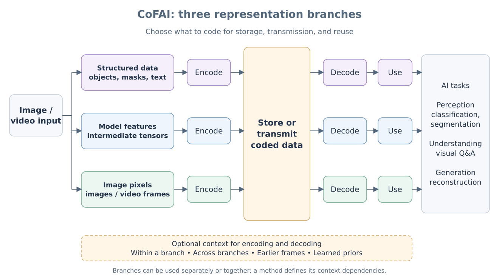
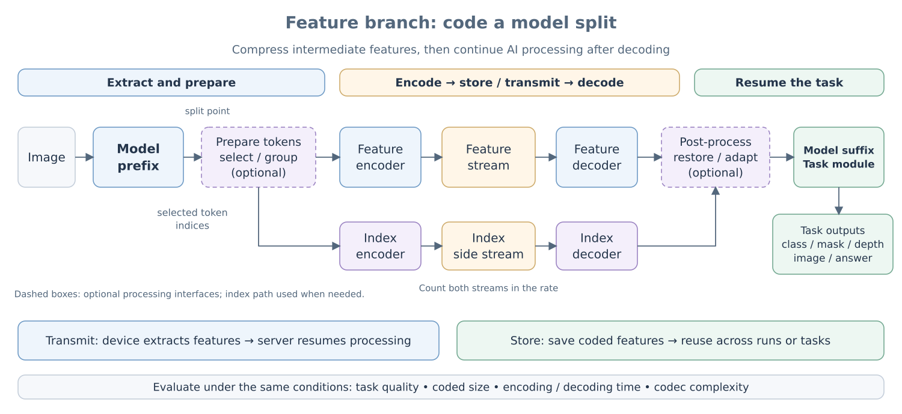

# CoFAI 框架概念

CoFAI（Coding for AI）面向机器感知、理解与生成任务，研究如何对 AI 系统所需的
多种视觉表征进行统一组织、编码、传输和复用。它不只是一套“压缩某层特征”的算法
集合，而是一个从表征类型、上下文关系、码流组织到任务评测的参考框架。

本文描述长期稳定的概念模型。当前参考软件对这些概念的实现范围和对应代码见
[参考软件实现](reference_software.md)；评测入口、plan 和数据契约见
[Engine 架构与数据流](engine.md)。

## 1. 目标与边界

传统图像和视频编码主要服务于人眼观看。面向 AI 的编码还需要考虑：

- 中间表征是否能被多个任务或模型复用；
- 端侧与云侧如何在模型切分点交换紧凑表征；
- 像素、基础模型特征和结构化语义如何联合编码；
- 层间与帧间上下文如何提升编码效率；
- 不同方案能否在一致的数据、预处理、码率和任务指标下公平比较。

CoFAI 同时覆盖两类典型部署场景：

1. **存储与特征复用**：特征被离线保存，供多个下游任务或模型重复使用。
2. **端云协同**：模型在某个切分点分为端侧前缀和云侧后缀，编码后的中间表征在
   设备间传输，用于即时推理或后续训练。

框架关注三类任务：

- **Perception**：分类、分割、检测、检索等感知任务；
- **Understanding**：视觉问答、异常检测等理解任务；
- **Generation**：图像重建和其它生成任务。

## 2. 三类表征数据

CoFAI 将视觉场景的可编码信息归纳为三类表征。它们可以单独形成编码层，也可以在
同一个访问单元中联合出现。

| 表征 | 含义 | 典型示例 |
|---|---|---|
| 结构数据 | 已提取的离散或结构化语义 | 文本、目标、分割、运动、token 选择索引 |
| 基础视觉模型特征 | 模型切分点上的连续或离散中间表征 | DINO、SigLIP、视觉语言模型和 ReID token |
| 图像数据 | 可供人眼观看或用于重建、生成的像素表征 | 原始图像、重建图像、视频帧 |

**整体三分支视图**



三条分支可以独立使用，也可以组合使用。上下文由具体方案选择，并需要明确编码端
和解码端如何获得它；图中的上下文集合不意味着任意分支都自动拥有其它分支的数据。

“层”表示一种完整表征，不等同于神经网络中的 Transformer layer。为了避免混淆，
神经网络切分位置统一使用 [slot](reference_software.md#6-slot-与模型切分点) 描述。

## 3. 上下文关系

编码一个表征时，可以使用以下上下文：

- **表征内上下文**：同一表征内部的空间、通道、token 或概率依赖；
- **层间上下文**：同一时刻其它表征层提供的条件信息；
- **帧间上下文**：其它时间点的同层或跨层信息；
- **超先验或外部先验**：由独立潜变量、模型参数或共享知识提供的概率条件。

上下文是可选依赖，不意味着所有解码端都必须恢复所有表征。具体方案需要明确：

1. 编码和解码依赖哪些上下文；
2. 上下文是否进入码流；
3. 解码顺序和缺失层时的行为；
4. 上下文自身的码率如何统计。

## 4. 码流组织术语


| 术语 | 缩写 | 定义 |
|---|---|---|
| Data Unit | DU | 承载某一时刻、某一种完整表征的基本编码单元 |
| Access Unit | AU | 同一时刻所有 DU 的逻辑集合 |
| Layer | Layer | 同一表征类型在时间维度上的逻辑层 |
| Coded Layer Video Sequence | CLVS | 一个 CVS 中，同一层连续 DU 构成的序列 |
| Coded Video Sequence | CVS | 按解码顺序组织的一组 AU |

单图实验可以只有一个 AU；只有一个表征时，AU 中只有一个 DU。即便参考实验尚未生成
最终规范码流，也应使用这些术语描述表征边界和依赖关系。

## 5. 三种方案层级

CoFAI 按表征维度和时间维度把方案分为三个逐步扩展的层级：

| 层级 | 表征关系 | 时间关系 | 典型研究内容 |
|---|---|---|---|
| 单层单帧 | 一个表征层 | 一个时刻 | 基础模型特征编码、token 编码 |
| 多层单帧 | 多个联合表征层 | 一个时刻 | 多层特征、视觉与语义联合编码 |
| 多层多帧 | 多个联合表征层 | 多个时刻 | 层间与帧间联合的特征视频编码 |

**简化示意**


**完整方案层级图**


这是一种框架分类，不代表参考软件已经以同等成熟度实现了三个层级。当前代码以
单层单帧特征评测最成熟，多层和视频能力仍包含方法专用实现与探索性接口。

## 6. Feature DU

Feature DU 在模型切分点编码基础模型的中间特征。前缀网络位于编码侧，后缀网络和
任务头位于解码侧。



抽象流程为：

```text
image
  -> backbone prefix
  -> feature/token preprocessing
  -> feature codec
  -> feature/token postprocessing
  -> backbone suffix
  -> task heads
```

其中预处理和后处理是可选步骤。例如 Token Grouping 可以在编码前选择紧凑 token，
同时产生描述选择关系的索引；是否需要在解码后恢复稠密 token 网格由具体任务决定。

## 7. Coded Unit 语义

研究阶段使用 `coded_unit` 表示一个 DU 的中间编码结果：

```python
coded_unit = {
    "strings": {
        "feature": [[feature_bytes]],
        "selection_map": [[index_bytes]],
    },
    "pstate": {
        # 解码所需、未来应映射到高层语法的状态
    },
}
```

- **`strings`** 是可计入实际码率的 byte stream 映射。一个 DU 可以包含多个流，例如
  主特征流、超先验流、prefix token 流或结构索引流。
- **`pstate`** 是解码所需但尚未完成规范序列化的状态，例如形状、slot、QP、token
  空间尺寸和组件参数。具体方案必须说明哪些状态最终需要进入高层语法并计入码率。
- `strings` 的键描述流的语义，不应依赖字典顺序表达解码依赖。

评测阶段还允许 codec 返回 `likelihoods` 或显式 `bits` 来估计码率。它们是统一评测
接口，不等价于已经生成可互操作码流；正式结果应明确区分估计码率与真实 byte stream。

多层或多帧结果可进一步组织为：

```python
coded_data = {
    "type": "frame",
    "data": {
        "feature": feature_coded_unit,
        "image": image_coded_unit,
    },
}
```

视频可以按帧组织为 `frame_wise_video`，也可以按层组织为 `layer_wise_video`。前者更
接近解码和播放顺序，后者便于研究阶段按层访问。无论采用哪一种形式，都必须明确
帧序、层序、依赖关系和缺失 DU 的处理规则。

## 8. 评测原则

框架要求一次可复现评测至少固定以下条件：

- 数据集、样本列表和预处理；
- backbone、权重、slot 和特征语义；
- codec 参数、真实或估计编码模式以及质量点；
- 任务头、任务指标和输出后处理；
- 像素数、特征数及 BPP/BPFP 分母定义；
- 参数量、FLOPs、编解码时间、GPU 和软件环境；
- 输出位置及完整的最终配置。

CoFAI 使用一份 plan 固定这些条件，使不同 codec 可以在相同协议下替换和比较。
plan 是参考软件的实验描述机制，不是规范码流语法本身。

## 9. 文档边界

- 本文回答“CoFAI 要描述什么、如何组织表征和码流”。
- [参考软件实现](reference_software.md)回答“当前代码如何映射这些概念”。
- [Engine 架构与数据流](engine.md)回答“如何构建并执行一次统一评测”。
- 各 `examples/<method>/` 文档回答“具体方法如何训练、下载和复现”。

正式文档只维护框架定义、当前代码事实和已经落实到接口或评测协议的稳定约定。
