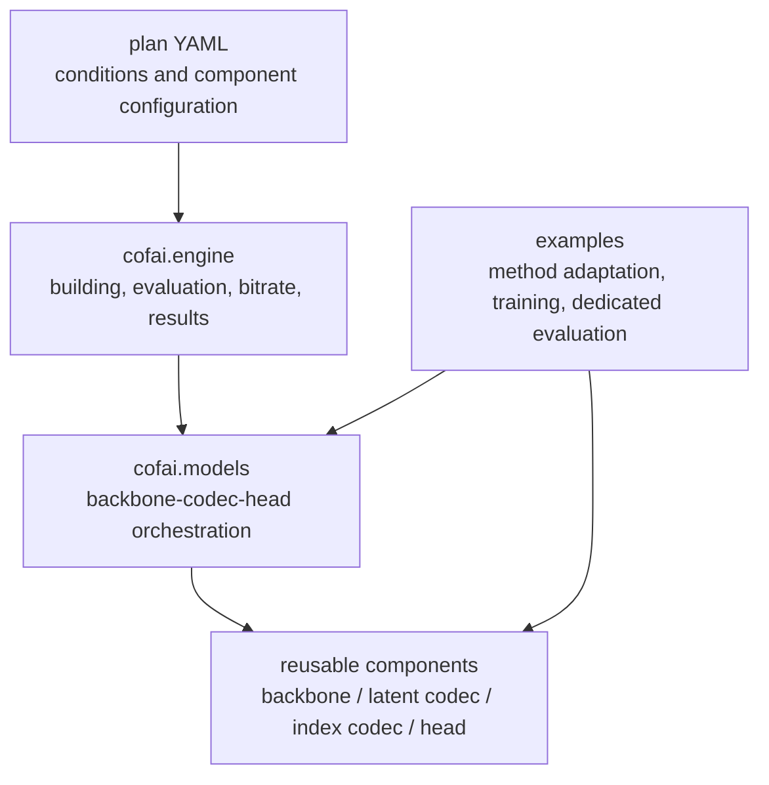
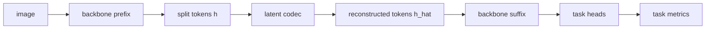
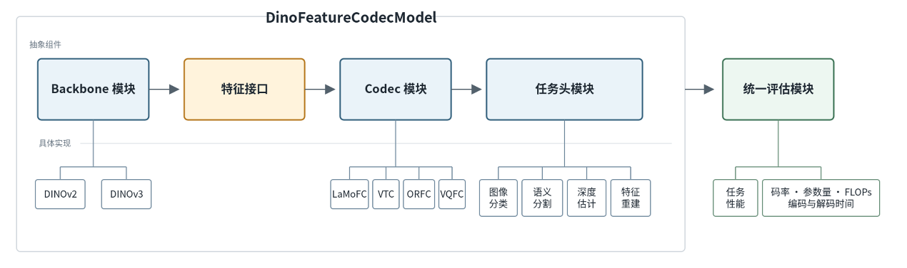
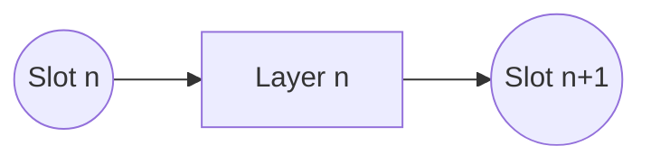
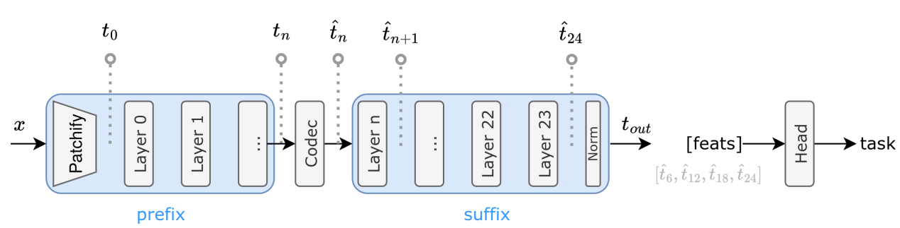
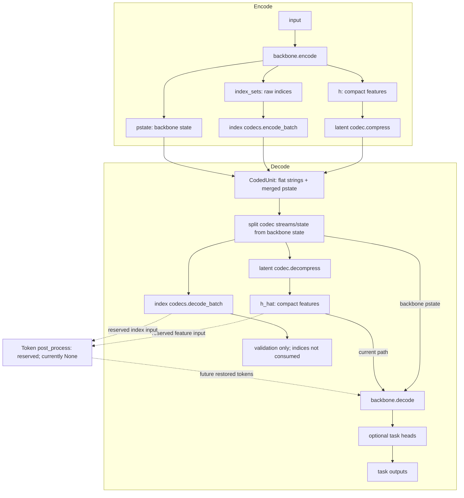

# CoFAI Reference Software Implementation

This guide explains how the reference software implements the [CoFAI framework](framework.md), including component responsibilities, public interfaces, and implementation status. Method-specific guides provide reproduction instructions.

See the [evaluation engine guide](engine.md) for the contracts governing plans, datasets, transforms, task meters, and result files.

## 1. Implementation Layers

An evaluation plan selects the experimental conditions and components. The engine builds and runs them; model classes connect backbones, codecs, and task heads; reusable components implement their individual operations.



- `cofai/` contains reusable components and shared evaluation support.
- `conf/plan/` contains runnable evaluation plans.
- `examples/` contains method-specific adaptation, training, offline experiments, and implementations that have not yet been integrated into shared components.

## 2. Component Namespaces

| Namespace | Responsibility | Examples |
|---|---|---|
| `cofai.backbone` | Model prefixes, suffixes, and split-point features | DINOv2, DINOv3, Qwen3-VL, GPS/TransReID |
| `cofai.latent_codecs` | Coding feature values or token values | MPC, VTC, VQFC, ORFC, VTM, raw dtype, bypass |
| `cofai.index_codecs` | Coding discrete indices and selection maps | Uniform index, adaptive bitmap index |
| `cofai.token_grouping` | Token selection, grouping, and structural results | GPS token grouping |
| `cofai.heads` | Task prediction or reconstruction | Classification, segmentation, depth, RAE, ReID |
| `cofai.datasets` | Images, features, video, and task data | Classification, segmentation, NYUv2, MMStar |
| `cofai.metrics` | Task metrics and per-sample aggregation | Accuracy, mIoU, depth, VQA, image quality |
| `cofai.engine` | Plan execution and shared evaluation contracts | Registry, EvalBatch, bitrate, profiling |

Feature-value coding belongs to `latent_codecs`; discrete-index coding belongs to `index_codecs`. These namespaces replace the earlier `token_codecs` namespace and distinguish the semantics of the coded data.

## 3. Model Orchestration

`cofai.models` combines components into complete coding and task-inference pipelines.

| Model | Purpose | Implementation status |
|---|---|---|
| `DinoFeatureCodecModel` | Single-window DINOv2/DINOv3 feature coding and multi-task decoding | Main shared evaluation path |
| `DinoSlideFeatureCodecModel` | Sliding-window feature coding and segmentation fusion | Specialized shared path |
| `Qwen3vlFeatureCodecModel` | Qwen3-VL vision-feature coding and VQA generation | CTC evaluation path |
| `CommonFeatureCodecModel` | General feature coding with optional token grouping and index side streams | Experimental interface |
| MPC models | Joint coding of multi-layer features and image context | Method-specific compatibility paths |
| MLoRE frame/video models | RFC multi-task models and video containers | Method-specific paths |

Shared evaluation paths have common plans and component boundaries. Experimental interfaces may change as methods evolve. Method-specific paths have not yet fully converged on the shared model interfaces.

## 4. DINO Feature Coding

`DinoFeatureCodecModel` connects a backbone, a latent codec, and task heads.





Evaluation supports two bitrate paths:

1. `forward_test` calls the codec's forward interface and reads `likelihoods` or `bits`.
2. `compress`/`decompress` produce and consume actual `strings` for coded-size and encoding/decoding-time measurements.

The model stores `token_res` in `pstate` so the decoder can recover the spatial meaning of the token sequence. Depending on the configured heads, reconstructed features support classification, segmentation, depth estimation, and image reconstruction.

`DinoSlideFeatureCodecModel` adds sliding-window crops, per-crop coding, and full-image logit fusion. It uses a `type: slide_crops` coded-data container; bitrate accounting sums the streams from all crops.

## 5. Qwen3-VL Feature Coding

`Qwen3vlFeatureCodecModel` also splits a backbone around a codec, but VQA does not use a separate generic task head. Decoded visual tokens re-enter the vision-encoder suffix, and the language model generates the answer.

```text
image + prompt
  -> Qwen3-VL vision prefix
  -> vision tokens
  -> latent codec
  -> vision suffix
  -> language model generation
  -> VQA metric
```

The prompt is a task input used during decoding and generation; it is not passed to the feature codec's `compress` method. The current shared CTC plan uses MMStar and slot 9.

## 6. Slots and Model Split Points

Transformer blocks are numbered from `Layer 0`. CoFAI names their tensor boundaries as follows:

- The input to `Layer n` is `Slot n`.
- The output of `Layer n` is `Slot n+1`.

The output of DINOv3 `Layer 23` is therefore `Slot 24`. This separates the number of executed blocks from the tensor boundary and avoids confusing Transformer layers with CoFAI representation layers.





Current shared CTC plans include:

| Model | Slot | Tasks |
|---|---|---|
| DINOv3 ViT-L/16 | 24 | ADE20K segmentation, NYUv2 depth |
| Qwen3-VL 8B Instruct | 9 | MMStar VQA |

Use slot names in plan names, configuration fields, and reports. When citing layer numbers from earlier documents, also give the corresponding slot to avoid an off-by-one ambiguity.

## 7. Token Grouping and Multi-Stream Data Units

Token grouping produces compact features and discrete indices describing selection or grouping relationships.

The [conceptual feature-branch diagram](framework.md#6-feature-du) includes token preprocessing, separate feature and mask/index coding, and token restoration before the task module. In the current implementation, token preprocessing belongs to the relevant backbone's `encode` method. `post_process` is a reserved, unimplemented extension point and must currently be `None`.

The experimental `CommonFeatureCodecModel` currently follows these rules:

1. A simple backbone's `encode` may return a tensor alone.
2. A backbone requiring structural side information returns `h`, `pstate`, and raw `index_sets`.
3. The backbone does not write byte streams.
4. The latent codec codes `h`; configured index codecs code the corresponding `index_sets`.
5. The model places all streams in the same CodedUnit's flat `strings` mapping.



Decoded index side streams currently undergo decodability validation only. Their indices do not yet restore `h_hat` or a dense token grid.

```python
encoded = {
    "h": compact_features,
    "pstate": {"token_res": (height, width)},
    "index_sets": {"selection_map": bounded_indices},
}

coded_unit = {
    "strings": {
        "feature": [[feature_bytes]],
        "selection_map": [[map_bytes]],
    },
    "pstate": {...},
}
```

`selection_map` and `feature` are distinct named streams within one DU. Shared bitrate accounting reports each stream and their total.

The GPS ReID decoder consumes compact token sequences directly rather than restoring a complete two-dimensional grid. Dense token restoration remains part of the architecture through the reserved, unimplemented `post_process` interface.

## 8. CodedUnit and Bitrate Accounting

`cofai.engine.bitrate` accepts three bitrate sources for a single DU:

| Field | Meaning | Use |
|---|---|---|
| `strings` | Actual byte streams | Real coding and per-stream accounting |
| `likelihoods` | Probability-model outputs | Estimated bitrate |
| `bits` | Explicit component-provided bit counts | Analytical paths without likelihoods |

Actual stream size is computed from the total byte lengths. `bits_from_coded_data` supports `unit`, `frame`, `frame_wise_video`, `layer_wise_video`, and `slide_crops` containers.

These containers implement the [encoder semantic conventions](framework.md#7-encoder-semantic-conventions) and support shared evaluation and bitrate aggregation. Complete serialization of `pstate` into interoperable high-level bitstream syntax remains under development.

## 9. Evaluation Engine and Plans

A plan specifies the dataset, transforms, model, weights, tasks, metrics, quality settings, and output location. The engine executes the following sequence:

```text
Hydra compose
  -> component registry build
  -> dataset / transforms / EvalBatch
  -> model forward_test or compress/decompress
  -> task meters + bitrate + timing
  -> result.json + config.yaml
```

`args.profile=true` additionally measures latent-codec parameter count, encoding/decoding FLOPs, and runtime. `args.multi_run=true` evaluates the plan's quality settings and writes `summary.json`.

Task contracts separate `kind` from `label`: `kind` identifies the dataset's ground-truth semantics, while `label` identifies a model output. This allows multiple output variants for the same task to be compared.

## 10. Framework Coverage

| Framework level | Current implementations | Status |
|---|---|---|
| Single-layer, single-frame | DINO CTC, LaMoFC, VQFC, VTC, ORFC, GPS | Main evaluation paths |
| Multi-layer, single-frame | MPC branches and joint visual/feature coding | Implemented; interfaces still being unified |
| Multi-layer, multi-frame | CAVC, MLoRE video paths | Experimental and method-specific |

New methods should identify their framework level and preserve their actual cross-layer or temporal dependencies. Shared abstractions should reflect concrete reuse needs rather than prematurely fixing interfaces for a single method.

## 11. Integrating Reusable Components

Integration typically involves:

1. Keeping the original runnable implementation and reproduction results in `examples/<method>/`.
2. Establishing a baseline with the same weights, data, preprocessing, and metrics.
3. Moving reusable backbones, codecs, heads, and metrics into `cofai/`.
4. Expressing evaluation conditions in a plan.
5. Comparing results before and after refactoring to verify equivalent evaluation behavior.
6. Documenting resources, commands, result paths, and remaining limits in the method guide.

Keep this implementation guide synchronized with code and engine documentation as interfaces change.
