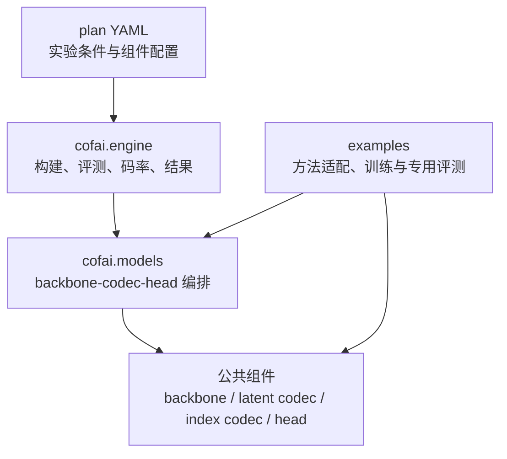
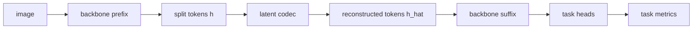
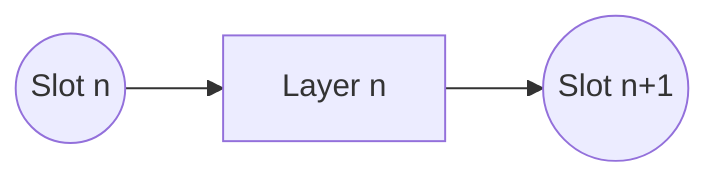
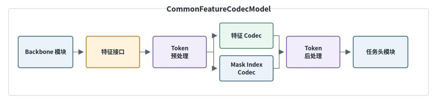
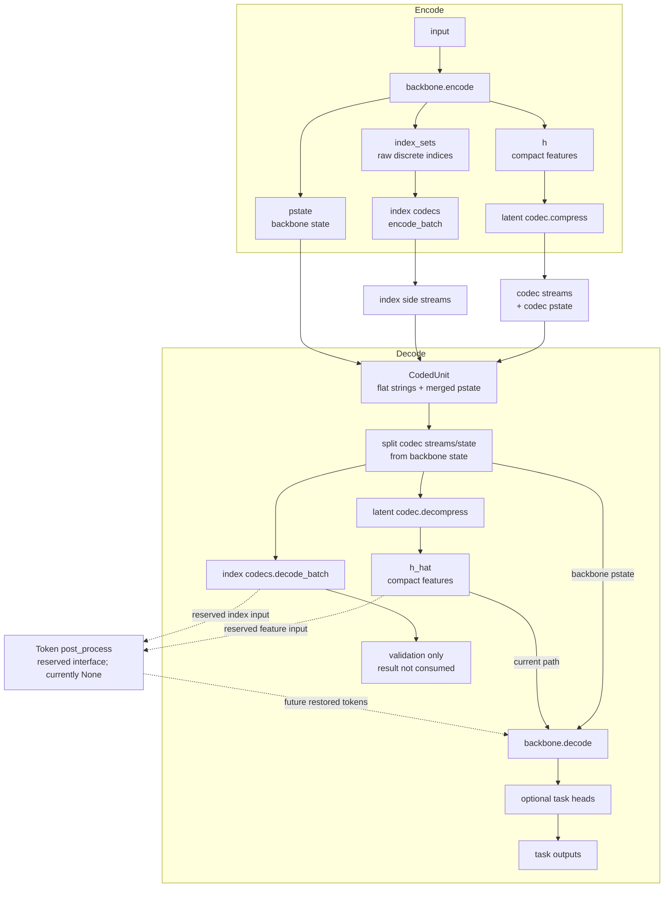

# CoFAI 参考软件实现

本文说明当前参考软件如何实现 [CoFAI 框架概念](framework.md)。它描述代码事实、
公共接口和成熟度边界，不替代具体方法的复现文档，也不把探索性实现承诺为稳定 API。

评测 plan、dataset、transform、meter 和结果文件的详细契约见
[Engine 架构与数据流](engine.md)。

## 1. 实现分层

当前代码分为四层：



- `cofai/` 保存跨方法复用的组件和统一评测能力；
- `conf/plan/` 保存可以直接运行的公共评测计划；
- `examples/` 保存方法专用数据适配、训练、离线实验和仍在收敛的实现；
- 新能力通常先在 `examples/` 跑通，再在参考软件更新窗口中沉淀到 `cofai/`。

## 2. 公共组件命名空间

| 命名空间 | 责任 | 当前示例 |
|---|---|---|
| `cofai.backbone` | 模型前缀/后缀和切分点特征 | DINOv2、DINOv3、Qwen3-VL、GPS/TransReID |
| `cofai.latent_codecs` | 连续特征或 token value 编解码 | MPC、VTC、VQFC、ORFC、VTM、raw dtype、bypass |
| `cofai.index_codecs` | 离散索引和选择关系编解码 | uniform index、adaptive bitmap index |
| `cofai.token_grouping` | token 选择、分组及结构结果 | GPS token grouping |
| `cofai.heads` | 下游任务预测或重建 | 分类、语义分割、深度、RAE、ReID |
| `cofai.datasets` | 图像、特征、视频和任务数据 | classification、segmentation、NYUv2、MMStar |
| `cofai.metrics` | 任务指标和逐样本聚合 | accuracy、mIoU、depth、VQA、图像质量 |
| `cofai.engine` | plan 执行和公共评测协议 | registry、EvalBatch、bitrate、profiling |

`token_codecs` 已不再作为公共命名空间：特征值编码属于 `latent_codecs`，离散索引
编码属于 `index_codecs`。这一划分对应数据语义，而不是某个特定方法。

## 3. 模型编排层

`cofai.models` 负责把公共组件组合成一次完整的编码与任务推理。当前主要模型为：

| 模型 | 用途 | 状态 |
|---|---|---|
| `DinoFeatureCodecModel` | DINOv2/DINOv3 单窗口特征编码与多任务解码 | 公共主路径 |
| `DinoSlideFeatureCodecModel` | 大图滑窗特征编码与语义分割融合 | 公共专用路径 |
| `Qwen3vlFeatureCodecModel` | Qwen3-VL 视觉切分点编码与 VQA 生成 | CTC 专用路径 |
| `CommonFeatureCodecModel` | 可带 token grouping 和 index side stream 的通用探索模型 | 探索性接口 |
| MPC 系列模型 | 多层特征/图像上下文联合编码 | 方法兼容路径 |
| MLoRE frame/video 模型 | RFC 多任务和视频容器 | 方法专用路径 |

“公共主路径”表示已有统一 plan 和组件边界；“探索性接口”表示代码可运行且有测试，
但接口仍可能随相关方法改变；“方法专用路径”表示尚未完全收敛到统一模型。

## 4. DINO 特征编码主路径

`DinoFeatureCodecModel` 把模型分为 backbone、latent codec 和 task heads：

**简化数据流**



**当前实现组件图**


在线评测有两条码率路径：

1. `forward_test` 调用 codec 的前向接口，读取 `likelihoods` 或 `bits`；
2. `compress`/`decompress` 生成并消费真实 `strings`，用于实际码率和编解码时间。

模型在 `pstate` 中保存 `token_res`，使 decoder 能把 token 序列恢复到正确的空间语义。
根据 plan 配置的 heads，同一重建特征可以服务分类、语义分割、深度和图像重建任务。

`DinoSlideFeatureCodecModel` 在上述流程外增加滑窗 crop、逐 crop 编码和全图 logits
融合。其输出使用 `type: slide_crops` 的 coded-data 容器，码率由所有 crop 的流累加。

## 5. Qwen3-VL 路径

`Qwen3vlFeatureCodecModel` 沿用“backbone + codec”的切分思路，但 VQA 不使用独立的
通用 task head：解码后的视觉 token 重新注入视觉编码器后缀，并由语言模型生成答案。

```text
image + prompt
  -> Qwen3-VL vision prefix
  -> vision tokens
  -> latent codec
  -> vision suffix
  -> language model generation
  -> VQA metric
```

prompt 属于任务输入，只在解码/生成阶段使用，不进入 feature codec 的 `compress`。
当前公共 CTC plan 使用 MMStar 和 slot 9。

## 6. Slot 与模型切分点

Transformer block 从 `Layer 0` 开始计数。CoFAI 对切分点采用以下约定：

- `Layer n` 的输入称为 `Slot n`；
- `Layer n` 的输出称为 `Slot n+1`。

因此，DINOv3 的 `Layer 23` 输出写作 `Slot 24`。这种命名明确区分“执行了多少个
block”和“切分发生在哪个张量边界”，也避免与 CoFAI 表征 Layer 混淆。

**简化约定**



**DINO 切分示意**


当前 CTC 中已经落入公共 plan 的切分点包括：

| 模型 | Slot | 任务 |
|---|---|---|
| DINOv3 ViT-L/16 | 24 | ADE20K semantic segmentation、NYUv2 depth |
| Qwen3-VL 8B Instruct | 9 | MMStar VQA |

plan 名称、配置字段和报告中都应使用 slot 表述。引用旧文档的 Layer 编号时，应同时
给出对应 slot，避免发生一位偏移。

## 7. Token Grouping 与多流 DU

Token Grouping 会同时产生紧凑特征和描述选择关系的离散索引。

**完整概念结构（原图）**



原图表达的是完整功能边界：特征接口之后对 token 做结构化预处理，特征和
mask/index 分别编码，解码后再恢复任务模块所需的 token 形态。它不等同于
当前参考软件已经落地的类边界：“Token 预处理”目前由具体 backbone 的
`encode` 承担；“Token 后处理”已作为 `post_process` 扩展点预留，但当前
参数必须为 `None`，尚无可执行实现和稳定调用契约。

**当前参考软件数据流（简化图）**

当前探索性 `CommonFeatureCodecModel` 规定：

1. 普通 backbone 的 `encode` 可以只返回 tensor；
2. 需要结构侧信息的 backbone 返回 `h`、`pstate` 和原始 `index_sets`；
3. backbone 不写 byte stream；
4. latent codec 编码 `h`，配置的 index codec 编码每个 `index_sets`；
5. 模型把所有流平铺到同一个 CodedUnit 的 `strings` 中。



图中的 index side streams 在当前解码路径上只做可解码性校验，解出的
indices 尚不参与 `h_hat` 或稠密 token 网格的恢复。

```python
encoded = {
    "h": compact_features,
    "pstate": {"token_res": (height, width)},
    "index_sets": {"selection_map": bounded_indices},
}

coded_unit = {
    "strings": {
        "feature": [[feature_bytes]],
        "selection_map": [[map_bytes]],
    },
    "pstate": {...},
}
```

这里 `selection_map` 和 `feature` 是同一个 DU 内语义不同的两个流，不需要额外嵌套
一层“codec”。统一码率模块按流分别统计，再计算总码率。

当前 GPS ReID decoder 直接消费 compact token sequence，并不恢复完整二维 token
网格；`post_process` 是已保留但未实现的架构接口。因此，文档和新方法
应继续保留“稠密恢复”的位置，同时将它标记为未实现的扩展点。

## 8. CodedUnit 与码率实现

`cofai.engine.bitrate` 接受三种单 DU 码率来源：

| 字段 | 含义 | 用途 |
|---|---|---|
| `strings` | 实际 byte stream | 真实编码、可逐流审计 |
| `likelihoods` | 概率模型输出 | 估计码率 |
| `bits` | 组件显式提供的 bit 数 | 无 likelihood 的分析路径 |

实际 `strings` 的 bit 数按所有 bytes 长度计算。`bits_from_coded_data` 还支持：

- `unit`；
- `frame`；
- `frame_wise_video`；
- `layer_wise_video`；
- `slide_crops`。

这些容器首先服务于统一评测和码率展开。`pstate` 尚未全部序列化为标准高层语法，
因此当前参考软件中的 CodedUnit 是研究阶段中间表示，不应直接宣称为最终互操作码流。

## 9. Engine 与 plan

一份 plan 固定 dataset、transforms、model、weights、tasks、metrics、质量点和输出位置。
Engine 依次完成：

```text
Hydra compose
  -> component registry build
  -> dataset / transforms / EvalBatch
  -> model forward_test or compress/decompress
  -> task meters + bitrate + timing
  -> result.json + config.yaml
```

`args.profile=true` 会额外统计 latent codec 参数量、编码/解码 FLOPs 和运行时间；
`args.multi_run=true` 会扫描 plan 声明的质量点并生成 `summary.json`。

任务数据采用 `kind` 与 `label` 分离的契约：`kind` 对应 dataset 中的 GT 语义，
`label` 对应模型输出名。这允许同一种任务同时比较多个输出方案。

## 10. 框架层级与当前覆盖

| 框架层级 | 当前实现 | 成熟度 |
|---|---|---|
| 单层单帧 | DINO CTC、LaMoFC、VQFC、VTC、ORFC、GPS 等 | 主要工作路径 |
| 多层单帧 | MPC 多分支和视觉/特征联合方案 | 已有实现，接口仍在统一 |
| 多层多帧 | CAVC、MLoRE video 等方法路径 | 探索和方法专用阶段 |

新增方案应明确自己属于哪个层级，不应为了适配统一 Engine 而掩盖真实的层间或帧间
依赖。公共抽象以明确的跨方法复用需求为依据，避免为单一方案提前固化接口。

## 11. 实现沉淀约定

一种新方法从参考实现进入公共能力，通常经过：

1. 在 `examples/<method>/` 保存原始可运行流程和复现结果；
2. 使用相同权重、数据、预处理和指标建立集成前基线；
3. 将可复用的 backbone、codec、head、metric 等沉淀到 `cofai/`；
4. 用 plan 表达正式评测条件；
5. 比较重构前后结果，确认接口统一没有改变评测口径；
6. 在方法文档中记录资源、命令、结果路径和仍未覆盖的限制。

本文只维护当前代码映射、实现边界和稳定接口；发生变化时应与代码和 Engine 文档同步。
