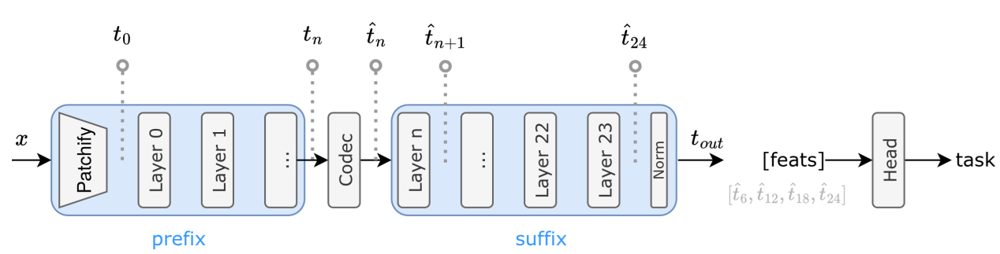

# DINOv3 CTC

本文给出 DINOv3 特征压缩在 **AI M2462 通用测试条件（CTC）** 下的配置约定，并整合底层统一架构（backbone / codec / head 三件套如何组合）的实现细节，可作为单一参考文档。

> 一句话：**模型 = backbone + codec + heads**，三者都是可插拔组件，通过 plan YAML 自由组合，不再为每种「backbone × 压缩方法 × 任务」组合单独写一个 Python 类。

## 1. 通用测试条件

根据 AI M2462 的 CTC 讨论，通用测试条件选定如下：

| 项 | 取值 |
|----|------|
| 模型 | DINOv3 `vitl16`（`model_size=large` + `patch_size=16`） |
| 分割点 | **Layer 23（必选）**；Layer 5 / 11 / 17 可选 |
| 输入尺度 | 原生尺寸（padding 到 16 的整数倍） |
| 下游任务 | 分割 / ADE20K，深度估计 / NYUv2，目标检测（未定），图像重建（未定） |

> 注意：CTC 评测取用的最后一层特征是 **norm 之前** 的特征。

## 2. 统一架构总览

重构前，每一种「backbone × 压缩方法 × 任务」的组合都对应一个独立的 `CompressionModel` 子类（`Dinov2OrigClsVQFC`、`Dinov2TimmSegVQFC`、各种 `*Bypass` / `*SlideSeg*` …），导致 slide 逻辑、prefix 处理、bits 统计等代码到处复制。

重构后收敛为三层，所有可变性（用哪个 backbone、哪个 codec、哪个 head、哪个数据集、切在第几层）都下沉到 **plan YAML**：

| 层 | 角色 | 数量 | 位置 |
|----|------|------|------|
| **CodecModel** | 编排 backbone→codec→head 的流程，处理任务分发与码率统计 | 固定 2 个 | `cofai/models/base.py` |
| **Backbone** | 提取 / 重建 DINO 特征，定义切分点（slot） | timm 统一 | `cofai/backbone/timm.py` |
| **LatentCodec** | 真正的压缩组件，遵循统一 token 接口 | 固定一组 | `cofai/latent_codecs/` |

## 3. 模型组织：两个 CodecModel

均定义于 `cofai/models/base.py`。CTC 默认使用单窗口的 `DinoFeatureCodecModel`，由三个可插拔组件构成：

- **backbone**：缺省 `Dinov3TimmBackbone`，提供切分点（slot），负责 `encode` / `decode_*`。
- **codec**：缺省 `BypassLatentCodec`（即不压缩）。在切分点对编码器 token `(B, N, C)` 做压缩 / 解压缩，均位于 `cofai/latent_codecs/`。plan 简称与实际类名对应如下：

| 简称 | LatentCodec 类 | 压缩原理 |
|-----------|----------------|----------|
| `Bypass` | `BypassLatentCodec` | 不压缩，直通 |
| `VQFC` | `VQFeatureCodec` | 向量量化（码本） |
| `ORFC` | `OrthoRotationFeatureCodec` | 正交旋转 + 乘积量化 + rANS |
| `VTM` | `VtmLatentCodec` | 标准视频编码器（VVC/VTM）打包压缩 |
| `VTC` | `VisualTokenCodec` | 视觉 token 编码（可变码率） |
| `MPC` | `VbrVitUnionLatentCodec` | 可变码率 ViT union 熵模型 |
| `RFC` | `MLoREFeatureCodec` | MLoRE 多任务低秩专家特征编码 |

- **head**：下游任务预测头，支持 `cls` / `seg` / `semseg` / `depth` / `rae`（特征重建），由提供的 `heads` 决定。


### `DinoSlideFeatureCodecModel`（滑窗子类，CTC 一般不用）

继承 `DinoFeatureCodecModel`，用于大图分割：把图切成重叠 crop，逐 crop 编码压缩，再把每个 crop 的重建特征融合成全分辨率 logits。滑窗逻辑（`slide_encode` / `slide_decode_seg`）内置在模型里，任何暴露 `encode` / `decode_seg` 的 backbone 都能用。`slide_codec_mode`：

- `per_crop`（默认）—— 每个 crop 单独调用一次 codec。
- `stacked` —— 所有 crop 堆进 batch 维，一次 codec 调用，例如使用标准编码器（VTM）。

## 4. LatentCodec 接口契约

所有 codec 都是 `nn.Module`，对**编码器 token 张量 `(B, N, C)`** 操作，实现以下三个方法（`token_res` 给空间型 codec 用，`qp` 给可变码率 codec 用）：

```python
forward(h, token_res, qp)    -> {"h_hat", "likelihoods"}               # 训练 / 在线：压缩+重建一步到位
compress(h, token_res, qp)   -> {"strings", "pstate"} # 仅编码
decompress(strings, pstate)  -> {"h_hat"}                    # 仅解码
```

## 5. Backbone 与分割点（slot）

backbone 统一用 timm 实现：`Dinov2TimmBackbone` / `Dinov3TimmBackbone`（`cofai/backbone/timm.py`）。backbone size 由 `model_size` + `patch_size` 决定，在 plan 文件名里写作 `vitl16`、`vitg14`、`vitb16` 等。



slot 约定：transformer block 从 0 开始计数记作 `Layer n`，其输入特征记作 `t_n`（对应 `Slot n`），输出特征记作 `t_(n+1)`（对应 `Slot n+1`），即

\[ t_{n+1} = \mathrm{Layer}_n(t_n) \]

- `slotNN` = `blocks[:NN]`：提取特征用前 NN 个 block，解码特征用其余 block。一律用**正整数**（不再用负数 / null）。
- `slotNNn` = 在第 NN 层之后**再过一次 `norm`** 作为提取的特征（不常用）。

据此，CTC 的分割点映射为：

| CTC 分割点 | slot |
|------------|------|
| Layer 23（必选） | `slot24` |
| Layer 17 | `slot18` |
| Layer 11 | `slot12` |
| Layer 5  | `slot6`  |


## 6. 下游任务头与权重

CTC 当前落地的两个任务头（见 `conf/heads/dinov3_head.yaml`）：

| 任务 | 数据集 | head 类型 | 预训练权重 |
|------|--------|-----------|------------|
| 语义分割 | ADE20K | `Dinov3SegmentationHead`（150 类，linear head） | `weights/dinov3/semseg_head/dinov3_vitl16_semseg_ade20k_linear_head.pth` |
| 深度估计 | NYUv2 | `Dinov3DepthHead`（linear head，depth 0.001–10.0） | `weights/dinov3/dpt_head/dinov3_vitl16_depth_nyuv2_linear_head.pth` |

目标检测、图像重建任务头待定。

## 7. Plan 组合与命名

用于参考的 plan 放在 `conf/plan/` 目录下，一般是 Bypass 基线。
各个提案的 plan 放在 `examples/proposal-xxx/plan/` 目录下。

文件名用 `__` 分四段：

```
<dataset>__<backbone-feature>__<codec>__<head>.yaml
```

字段含义：

- `dataset`：数据子集（`ade20k-val`、`nyuv2-val`、`imagenet-sel500` …）。
- `backbone-feature`：`<arch>-<size>[-reg4][-slide]-slot<NN>[n]`，`reg4` 表示带 4 个 register token，`slide` 表示滑窗模型。
- `codec`：`Bypass` / `VQFC` / `ORFC` / `VTM` / `VTC` / `MPC` / `RFC`，可变码率加 `-vbr`。
- `head`：`cls` / `semseg` / `depth` / `rae` 等，`-lastN` 表示用最后 N 个 block 的特征（N≠1 时标注）。

本 CTC 场景的基线（不压缩，精度天花板）示例：

```
ade20k-val__dinov3-vitl16-slot24__Bypass__semseg.yaml
nyuv2-val__dinov3-vitl16-slot24__Bypass__depth.yaml
```

plan 内部结构（节选）：

```yaml
model:
  type: DinoFeatureCodecModel                    # 或 DinoSlideFeatureCodecModel
  dino_backbone:
    type: cofai.backbone.Dinov3TimmBackbone
    model_size: large
    patch_size: 16
    slot: 24                                     # Layer 23 输出
  dino_codec:
    type: cofai.latent_codecs.BypassLatentCodec  # 基线不压缩
  heads:
    semseg: ${heads.ade20k_seg_large_last1}
```

DINOv2 的成熟范例可参考 `conf/dinov2-plan/`，例如：

```
conf/dinov2-plan/ade20k-val__dinov2-vitb16-reg4-slot09__Bypass__semseg-last4.yaml
conf/dinov2-plan/imagenet-sel500__dinov2-vitl14-slot11__ORFC__cls.yaml
```

## 8. 运行

通过统一评测引擎 `cofai-eval` 执行任一 plan：

```bash
CUDA_VISIBLE_DEVICES=0 \
  poetry run cofai-eval \
  conf/plan/ade20k-val__dinov3-vitl16-slot24__Bypass__semseg.yaml

# plan 内定义了 multi_run 时做 RD 扫描
CUDA_VISIBLE_DEVICES=0 \
  poetry run cofai-eval \
  conf/plan/ade20k-val__dinov3-vitl16-slot24__Bypass__semseg.yaml \
  args.multi_run=true
```

结果（bpp / bpfp / mIoU 或 RMSE 等）写入 `logs/<plan-name>/result.json`。

## 9. 增加新组合的步骤

得益于归约，新增一种实验通常**无需写 Python**：

1. 选 CodecModel（单窗口 `DinoFeatureCodecModel` / 滑窗 `DinoSlideFeatureCodecModel`）。
2. 选 backbone + slot。
3. 选 LatentCodec 并填参数；若需新压缩算法，新增一个遵循第 4 节接口的 `XxxFeatureCodec` 并在 `cofai/latent_codecs/__init__.py` 导出。
4. 选 head 与数据集。
5. 按第 7 节命名写 plan，丢进对应 plan 目录，用 `cofai-eval` 跑。
