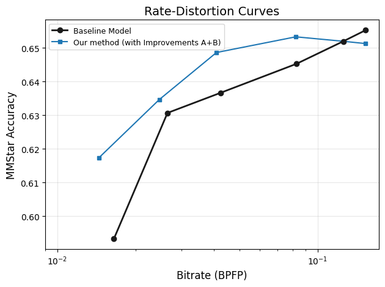

# M2510 PCA-Align

## Added code:
1. Core codec: `SimpleHyperpriorUDualGain` class in `cofai/latent_codecs/pca_align.py`.
2. Some layers in `cofai/layers/simple_depthwise_cnn.py`. They are not exactly the same as DCVC's depthwise layers, so I made a new file for them.
3. Execution plan in `cofai/examples/pca_align/plan/`, following CoFAI common practice.

## To crosscheck:
`python cofai/engine/run_eval.py examples/pca_align/plan/mmstar__qwen3vl-8b-ins-slot9__pca-align__vqa.yaml --multirun`

(Place `U-fix.npy`, `mean-fix.npy` and `ckpt_epoch_5.pth` in `weights/pca_align/` first)

## Note on performance:
1. My original experiments were not conducted on the CoFAI platform; in consequence the performance reported in M2510 slightly deviates from CTC protocols.
Running the strict CoFAI CTC protocols on my checkpoint, here are the corrected results (on A6000 GPU):

The findings and ablations of M2510 remain valid.

2. The plan uses `real=True`. Performance is not the same when using `real=False`.